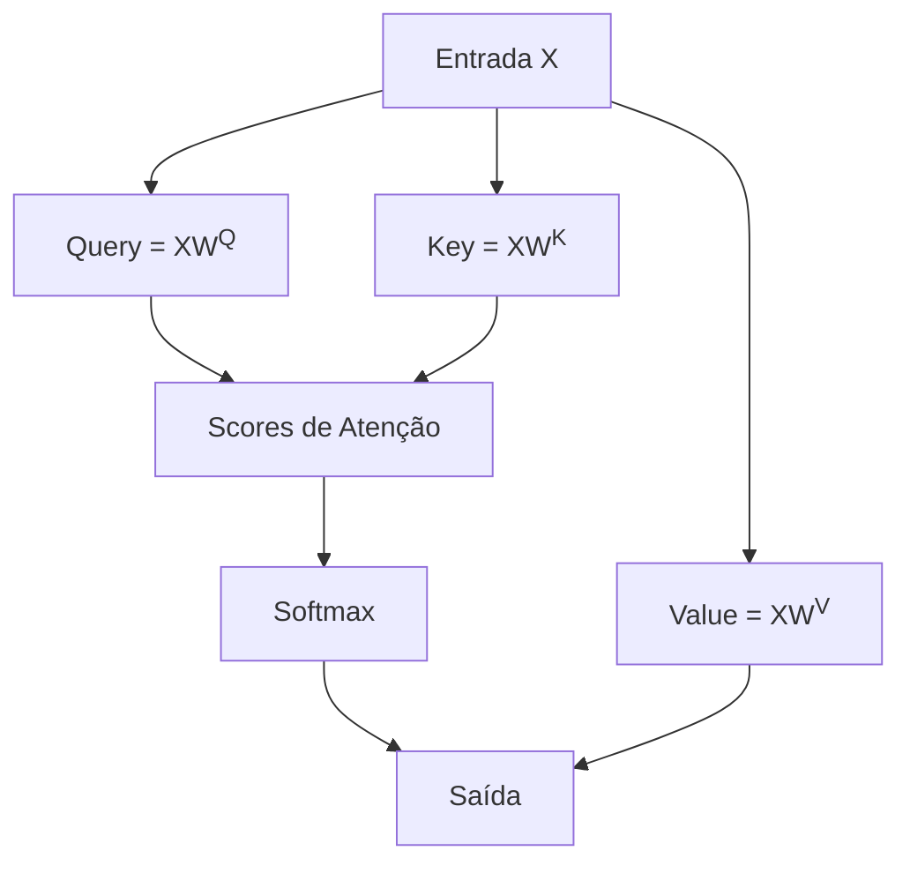
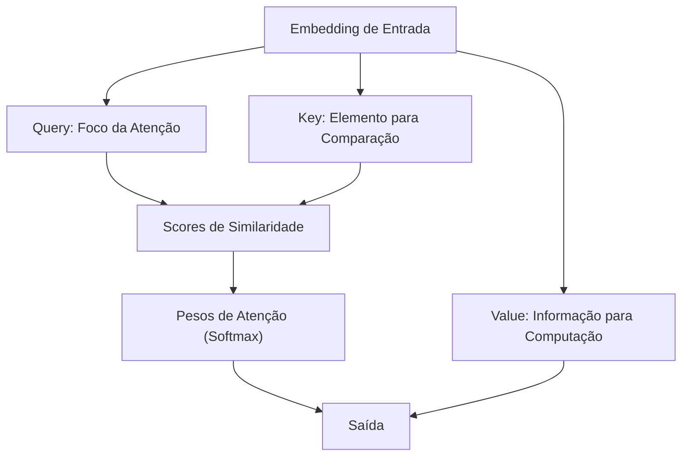
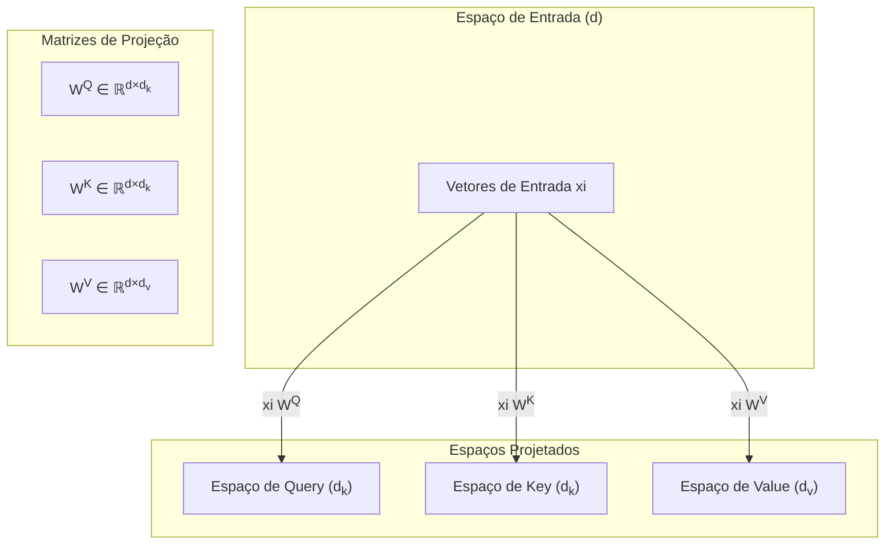

# 01. Mecanismos de Self-Attention e Blocos Transformers em Modelos de Linguagem de Grande Porte

https://claude.site/artifacts/11e8fa92-21ea-4ad3-8979-25105c6f49eb

### Introdução

Os **Transformers** revolucionaram a arquitetura de Modelos de Linguagem de Grande Porte (LLMs), introduzindo uma abordagem inovadora para o processamento de sequências de dados [^1]. A característica mais marcante desta arquitetura é a capacidade de processar sequências de entrada através de blocos Transformers empilhados. Cada bloco é uma rede neural multicamada que mapeia sequências de vetores de entrada $(x_1, ..., x_n)$ para sequências de vetores de saída $(z_1, ..., z_n)$ de mesmo comprimento [^1].

No coração desta arquitetura está o mecanismo de **self-attention**, uma inovação que permite à rede extrair e utilizar informações de contextos arbitrariamente grandes [^1]. Essa capacidade é crucial no processamento de linguagem natural, onde relações de longa distância entre palavras são fundamentais para a compreensão do significado.

### Self-Attention: Fundamentos Teóricos

https://claude.site/artifacts/63210716-f6cc-4829-97b3-d4d013ee577f

A essência do mecanismo de self-attention pode ser compreendida através de sua formulação matemática fundamental. Considere uma sequência de vetores de entrada $\{x_n\}$ em um espaço de embedding. O objetivo é mapear esta sequência para outra sequência $\{y_n\}$ que capture relações contextuais mais ricas [^2].

**Lema 1 (Representação por Combinação Linear):** Para cada vetor de saída $y_n$, existe uma representação como combinação linear dos vetores de entrada, ponderada por coeficientes de atenção $a_{nm}$:

$$
y_n = \sum_{m=1}^N a_{nm} x_m
$$

onde os coeficientes $a_{nm}$ satisfazem:

1. $a_{nm} \geq 0$ (não-negatividade)
2. $\sum_{m=1}^N a_{nm} = 1$ (normalização)

**Prova:**

1. **Cálculo das Projeções:**

   Cada vetor de entrada $x_m$ é transformado em três vetores distintos através de projeções lineares:

   $$
   \begin{aligned}
   q_m &= x_m W^{(q)} \quad \text{(query)} \\
   k_m &= x_m W^{(k)} \quad \text{(key)} \\
   v_m &= x_m W^{(v)} \quad \text{(value)}
   \end{aligned}
   $$

   onde $W^{(q)}, W^{(k)}, W^{(v)}$ são matrizes de peso aprendidas.

2. **Cálculo dos Scores de Atenção:**

   O score de atenção entre o elemento na posição $n$ e o elemento na posição $m$ é dado por:

   $$
   s_{nm} = \frac{q_n \cdot k_m}{\sqrt{d_k}}
   $$

   onde $d_k$ é a dimensão dos vetores de key e query, e $\cdot$ representa o produto escalar.

3. **Aplicação do Softmax:**

   Os coeficientes de atenção $a_{nm}$ são obtidos aplicando a função softmax aos scores:

   $$
   a_{nm} = \frac{\exp(s_{nm})}{\sum_{l=1}^N \exp(s_{nl})}
   $$

   Isso garante que:

   - $a_{nm} \geq 0$ (pois a exponencial de qualquer número real é positiva)
   - $\sum_{m=1}^N a_{nm} = 1$ (pois o softmax produz uma distribuição de probabilidade)

4. **Cálculo da Saída:**

   O vetor de saída $y_n$ é então calculado como a combinação ponderada dos valores $v_m$:

   $$
   y_n = \sum_{m=1}^N a_{nm} v_m
   $$

   Como $v_m = x_m W^{(v)}$, podemos expressar $y_n$ em termos dos vetores de entrada $x_m$:

   $$
   y_n = \sum_{m=1}^N a_{nm} x_m W^{(v)}
   $$

   Portanto, $y_n$ é uma combinação linear dos vetores de entrada $x_m$, ponderada pelos coeficientes de atenção $a_{nm}$. $\blacksquare$

>  🌀 **Comentário Avançado:** O **Lema 1** destaca que cada vetor de saída $y_n$ é uma combinação linear ponderada dos vetores de entrada $x_m$. ==**Essa operação pode ser interpretada geometricamente como uma média ponderada no espaço vetorial, onde os coeficientes de atenção $a_{nm}$ determinam a influência de cada vetor na direção resultante.**== Essa média ponderada permite que o modelo sintetize informações de múltiplas fontes, posicionando $y_n$ em um ponto do espaço que reflete as relações contextuais relevantes.

A implementação prática do self-attention envolve três transformações lineares principais através das matrizes $W^{(q)}$, $W^{(k)}$ e $W^{(v)}$, que produzem, respectivamente, os vetores de query, key e value.

A função de atenção escalonada é então definida como:

$$
\text{Attention}(Q, K, V) = \text{Softmax}\left(\frac{Q K^\top}{\sqrt{d_k}}\right) V
$$

### Arquitetura de Blocos Transformers

Um bloco Transformer completo combina o mecanismo de self-attention com redes feedforward e normalizações em uma estrutura sofisticada [^4]. Cada bloco pode ser representado pela seguinte sequência de operações:

**Teorema 1 (Composição de Blocos Transformer):** A transformação realizada por um bloco Transformer pode ser expressa como:

$$
\begin{aligned}
T^1 &= \text{SelfAttention}(X) \\
T^2 &= X + T^1 \quad \text{(Conexão Residual)} \\
T^3 &= \text{LayerNorm}(T^2) \\
T^4 &= \text{FFN}(T^3) \quad \text{(Feedforward Network)} \\
T^5 &= T^3 + T^4 \quad \text{(Conexão Residual)} \\
H &= \text{LayerNorm}(T^5)
\end{aligned}
$$

**Demonstração:**

1. **Self-Attention:**

   Aplicamos o mecanismo de self-attention aos vetores de entrada $X$, obtendo $T^1$:

   $$
   T^1 = \text{SelfAttention}(X)
   $$

2. **Conexão Residual 1:**

   Somamos a saída do self-attention $T^1$ à entrada original $X$ para formar $T^2$:

   $$
   T^2 = X + T^1
   $$

   Isso ajuda na propagação do gradiente e evita problemas de vanishing gradients.

3. **Normalização de Camada 1:**

   Aplicamos a normalização de camada (LayerNorm) a $T^2$ para obter $T^3$:

   $$
   T^3 = \text{LayerNorm}(T^2)
   $$

   A normalização melhora a estabilidade e acelera o treinamento.

4. **Rede Feedforward:**

   Passamos $T^3$ por uma rede feedforward (geralmente composta por duas camadas lineares com uma ativação não linear no meio) para obter $T^4$:

   $$
   T^4 = \text{FFN}(T^3)
   $$

5. **Conexão Residual 2:**

   Somamos a saída da feedforward $T^4$ ao tensor $T^3$ para formar $T^5$:

   $$
   T^5 = T^3 + T^4
   $$

6. **Normalização de Camada 2:**

   Aplicamos a normalização de camada a $T^5$ para obter a saída final $H$ do bloco Transformer:

   $$
   H = \text{LayerNorm}(T^5)
   $$

$\blacksquare$

https://claude.site/artifacts/653743b3-f0a3-453c-bb03-db931fc70390

> 🌀 **Comentário Avançado:** A arquitetura dos **blocos Transformers** combina operações de self-attention com redes feedforward e mecanismos de normalização, criando uma sequência de transformações geométricas sofisticadas. **Cada bloco pode ser visto como uma composição de mapeamentos não lineares que realinham os vetores em espaços latentes, enfatizando direções relevantes e atenuando ruídos.** ==As **conexões residuais** preservam a integridade das representações originais, enquanto as normalizações asseguram que as distribuições dos vetores permaneçam estáveis durante o fluxo através das camadas.==

[^1]: *"Transformers são formados por pilhas de blocos transformers, cada um dos quais é uma rede multicamada que mapeia sequências de vetores de entrada (x1, ..., xn) para sequências de vetores de saída (z1, ..., zn) do mesmo comprimento."* (Speech and Language Processing, Capítulo 10)

[^2]: *"A essência do mecanismo de atenção é a ideia de comparar um item de interesse a uma coleção de outros itens de uma forma que revela sua relevância no contexto atual."* (Speech and Language Processing, Capítulo 10)

[^3]: *"Os coeficientes devem ser não-negativos para evitar situações em que um coeficiente possa se tornar grande e positivo enquanto outro coeficiente compensa tornando-se grande e negativo."* (Speech and Language Processing, Capítulo 10)

[^4]: *"O cálculo do self-attention está no núcleo do que é chamado de bloco transformer, que, além da camada de self-attention, inclui três outros tipos de camadas."* (Speech and Language Processing, Capítulo 10)

### Atenção como Tabela de Consulta Suave (Soft Lookup)

A interpretação do mecanismo de atenção como uma tabela de consulta suave representa uma perspectiva teórica fundamental para compreender seu funcionamento em Modelos de Linguagem de Grande Porte [^5]. Este conceito estabelece uma analogia elegante com estruturas de dados tradicionais, proporcionando uma intuição mais profunda sobre o funcionamento interno dos Transformers.

==**Lema 2 (Propriedade de Lookup Suave):** O mecanismo de atenção pode ser formalizado como uma generalização contínua de uma tabela de consulta discreta, onde:==

1. Cada query $q$ interage com todas as keys $k_i$ simultaneamente.
2. Os pesos de atenção $\alpha_i$ formam uma distribuição de probabilidade sobre os values.
3. A saída é uma média ponderada dos values.

**Prova:**

1. **Tabela de Consulta Tradicional:**

   Em uma tabela de consulta discreta, para uma query $q$, buscamos a key $k_j$ que corresponde exatamente ou é mais semelhante a $q$, e retornamos o value associado $v_j$:

   $$
   \text{lookup}(q) = v_j \quad \text{onde} \quad j = \arg\max_i (q \cdot k_i)
   $$

   Aqui, o operador $\arg\max$ seleciona o índice $j$ que maximiza a similaridade (por exemplo, produto escalar) entre $q$ e $k_i$.

2. **Suavização com Softmax:**

   ==O mecanismo de atenção substitui a operação discreta $\arg\max$ por uma combinação ponderada usando o softmax. A saída é uma média ponderada de todos os values, onde os pesos são determinados pela similaridade entre $q$ e cada $k_i$:==
   $$
   \text{attention}(q) = \sum_{i=1}^N \alpha_i v_i
   $$
   
   com
   
   $$
   \alpha_i = \frac{\exp(q \cdot k_i / \sqrt{d_k})}{\sum_{j=1}^N \exp(q \cdot k_j / \sqrt{d_k})}
   $$
   
3. **Comparação:**

   - No lookup tradicional, apenas um único value $v_j$ é retornado.
   - ==No mecanismo de atenção, todos os values $v_i$ contribuem para a saída, ponderados por $\alpha_i$.==

4. **Conclusão:**

   A transição de uma seleção discreta para uma média ponderada contínua (suave) via softmax caracteriza o mecanismo de atenção como um lookup suave. $\blacksquare$

https://claude.site/artifacts/3ef7d043-9f4c-4d0f-9f52-0d693c175a52

> 🌀 **Comentário Avançado:** A interpretação da atenção como uma **tabela de consulta suave** oferece uma perspectiva geométrica elegante sobre o mecanismo. ==**Em vez de selecionar um único vetor de referência, o modelo efetua uma interpolação contínua no espaço de embeddings, onde a contribuição de cada value é ponderada pela similaridade espacial entre queries e keys.**== Isso permite capturar influências múltiplas e graduais de contextos diversos, resultando em representações mais ricas e robustas.

**Corolário 1:** A saída do mecanismo de atenção para cada posição é uma combinação convexa dos values, garantindo que a magnitude da saída permaneça controlada:
$$
\|O_i\| \leq \sum_{j=1}^N \alpha_{ij} \|v_j\| \leq \max_j \|v_j\|
$$

**Prova:**

1. Como $\alpha_{ij} \geq 0$ e $\sum_{j=1}^N \alpha_{ij} = 1$, temos que $\alpha_{ij}$ forma uma distribuição de probabilidade.

2. A norma da saída é:

   $$
   \|O_i\| = \left\| \sum_{j=1}^N \alpha_{ij} v_j \right\| \leq \sum_{j=1}^N \alpha_{ij} \|v_j\|
   $$

   (usando a desigualdade triangular)

3. Como $\alpha_{ij} \leq 1$, a soma ponderada das normas é limitada pelo máximo das normas dos $v_j$.

4. Portanto:

   $$
   \|O_i\| \leq \max_j \|v_j\|
   $$

$\blacksquare$

[^5]: *"Um mecanismo de lookup suave onde a rede pode olhar amplamente no contexto e determinar como integrar a representação de palavras nesse contexto."* (Speech and Language Processing, Capítulo 10)

[^6]: *"A normalização por softmax significa que a distribuição não é simétrica, embora a matriz de atenção resultante não seja ela própria simétrica."* (Deep Learning Foundations and Concepts, Capítulo 12)

### Análise Teórica da Complexidade do Lookup Suave

**Pergunta Teórica:** Como a complexidade computacional do mecanismo de atenção se compara com uma tabela de consulta tradicional?

**Lema 3 (Complexidade de Lookup):** Para uma sequência de comprimento $N$ e dimensão de embedding $d$, o mecanismo de atenção possui:

1. **Complexidade de Memória:** $O(N^2)$ para armazenar os pesos de atenção.
2. **Complexidade Computacional:** $O(N^2 d)$ para o cálculo completo.

**Prova:**

1. **Cálculo dos Scores de Atenção:**

   O cálculo de $Q K^\top$ envolve multiplicar uma matriz $Q \in \mathbb{R}^{N \times d_k}$ por uma matriz $K^\top \in \mathbb{R}^{d_k \times N}$, resultando em uma matriz de scores $S \in \mathbb{R}^{N \times N}$. Isso requer $O(N^2 d_k)$ operações.

2. **Aplicação do Softmax:**

   O softmax é aplicado a cada linha da matriz de scores $S$, o que envolve $O(N^2)$ operações.

3. **Multiplicação pelos Values:**

   Multiplicar a matriz de atenção normalizada $A \in \mathbb{R}^{N \times N}$ pela matriz de values $V \in \mathbb{R}^{N \times d_v}$ resulta na saída $O \in \mathbb{R}^{N \times d_v}$. Isso requer $O(N^2 d_v)$ operações.

4. **Complexidade Total:**

   Somando as operações acima e considerando que $d_k$ e $d_v$ são geralmente proporcionais a $d$, a complexidade computacional total é $O(N^2 d)$.

5. **Complexidade de Memória:**

   Armazenar a matriz de atenção $A \in \mathbb{R}^{N \times N}$ requer $O(N^2)$ espaço de memória.

$\blacksquare$

<Desenho: Um gráfico mostrando o crescimento da **complexidade computacional** e da **complexidade de memória** em função do **comprimento da sequência** $N$. Use curvas para representar $O(N)$, $O(N \log N)$ e **$O(N^2)$**, destacando que o mecanismo de atenção apresenta crescimento quadrático. *Inclua eixos claramente rotulados, legendas para cada curva e destaque a implicação de crescimento quadrático para sequências longas.*>

> ❗ **Limitação Crítica**: A complexidade quadrática em relação ao comprimento da sequência representa um gargalo significativo para o processamento de sequências muito longas [^7].

[^7]: *"A atenção é quadrática no comprimento da entrada, já que em cada camada precisamos computar produtos escalares entre cada par de tokens na entrada."* (Speech and Language Processing, Capítulo 10)

### Os Três Papéis dos Embeddings na Atenção

O mecanismo de atenção nos Transformers apresenta uma característica única e sofisticada: cada embedding de entrada desempenha três papéis distintos e complementares durante o processamento [^8]. Essa tríade de funções — **query**, **key** e **value** — forma a base do mecanismo de self-attention e merece uma análise teórica aprofundada.

**Teorema 3 (Decomposição Tripartite dos Embeddings):** Para cada embedding de entrada $x$, existem três transformações lineares distintas que produzem suas representações como query, key e value:

$$
\begin{aligned}
q &= x W^Q \\
k &= x W^K \\
v &= x W^V
\end{aligned}
$$

onde $W^Q, W^K \in \mathbb{R}^{d \times d_k}$ e $W^V \in \mathbb{R}^{d \times d_v}$ são matrizes de parâmetros aprendíveis.

**Lema 4 (Propriedade de Assimetria):** A separação em queries e keys permite que o modelo capture relações assimétricas na linguagem.

**Prova:**

1. **Definição dos Vetores:**

   Para dois tokens $x_i$ e $x_j$, calculamos suas projeções:

   $$
   \begin{aligned}
   q_i &= x_i W^Q \\
   k_j &= x_j W^K
   \end{aligned}
   $$

2. **Cálculo dos Scores de Atenção:**

   A atenção que o token $x_i$ presta ao token $x_j$ é dada por:

   $$
   \alpha_{ij} = \frac{\exp(q_i^\top k_j / \sqrt{d_k})}{\sum_{m=1}^N \exp(q_i^\top k_m / \sqrt{d_k})}
   $$

   De forma similar, a atenção que $x_j$ presta a $x_i$ é:

   $$
   \alpha_{ji} = \frac{\exp(q_j^\top k_i / \sqrt{d_k})}{\sum_{m=1}^N \exp(q_j^\top k_m / \sqrt{d_k})}
   $$

3. **Assimetria:**

   Como $q_i$ e $k_i$ são obtidos através de projeções diferentes ($W^Q \neq W^K$), em geral $q_i^\top k_j \neq q_j^\top k_i$. Portanto, $\alpha_{ij} \neq \alpha_{ji}$, estabelecendo a assimetria.

4. **Conclusão:**

   Essa assimetria é crucial para modelar relações linguísticas onde a relação entre dois tokens não é necessariamente simétrica, como em dependências gramaticais ou relações semânticas direcionais.

$\blacksquare$

<Desenho: Um diagrama mostrando um **vetor de entrada** $x_i$ sendo projetado em três vetores distintos: **query** $q_i$, **key** $k_i$ e **value** $v_i$, através das matrizes de projeção **$W^Q$**, **$W^K$** e **$W^V$**. Ilustre como o **query** $q_i$ interage com as **keys** $k_j$ para calcular os **scores de atenção**, resultando nos **pesos de atenção** $\alpha_{ij}$, que são usados para ponderar os **values** $v_j$ e produzir a saída. *Utilize setas para representar as projeções e interações, e inclua rótulos para cada componente e operação.*>

[^8]: *"Durante o curso do processo de atenção, cada embedding de entrada desempenha três papéis diferentes: como foco atual da atenção (query), como entrada precedente sendo comparada (key), e como valor usado para computar a saída (value)."* (Speech and Language Processing, Capítulo 10)

[^9]: *"Para capturar esses três papéis diferentes, os transformers introduzem matrizes de peso W^Q, W^K, e W^V."* (Speech and Language Processing, Capítulo 10)

### Transformações Lineares e Dimensionalidade em Atenção

O mecanismo de atenção utiliza transformações lineares específicas para projetar cada vetor de entrada em suas representações correspondentes de query, key e value [^12]. Esta seção explora em profundidade as propriedades matemáticas e dimensionais dessas transformações.

**Teorema 5 (Propriedades Dimensionais das Transformações):** Para um modelo Transformer com dimensão de embedding $d$, as transformações lineares satisfazem:

$$
\begin{aligned}
q_i &= x_i W^Q & W^Q &\in \mathbb{R}^{d \times d_k} \\
k_i &= x_i W^K & W^K &\in \mathbb{R}^{d \times d_k} \\
v_i &= x_i W^V & W^V &\in \mathbb{R}^{d \times d_v}
\end{aligned}
$$

onde $d_k$ e $d_v$ são as dimensões dos espaços de query/key e value, respectivamente [^13].

<Desenho: Um diagrama que representa as transformações lineares dos **vetores de entrada** $x_i$ nos espaços projetados. Mostre o **espaço de entrada** de dimensão $d$, as matrizes de projeção **$W^Q$**, **$W^K$**, **$W^V$**, e os **espaços projetados** de dimensões $d_k$ (para **queries** e **keys**) e $d_v$ (para **values**). Ilustre como cada $x_i$ é transformado em $q_i$, $k_i$ e $v_i$ através dessas matrizes. *Use blocos para os espaços e matrizes, setas para as transformações, e inclua rótulos claros para cada dimensão e componente.*>

**Teorema 6 (Variância dos Produtos Escalares):** Para vetores query e key aleatoriamente inicializados com média zero e variância unitária, a variância do produto escalar é proporcional a $d_k$:

$$
\text{Var}(q_i^\top k_j) = d_k
$$

**Prova:**

1. **Assumindo Vetores Aleatórios:**

   - Seja cada componente de $q_i$ e $k_j$ distribuído como $\mathcal{N}(0, 1)$.

2. **Produto Escalar:**

   - O produto escalar é $q_i^\top k_j = \sum_{l=1}^{d_k} q_{il} k_{jl}$.

3. **Cálculo da Variância:**

   - Como os $q_{il}$ e $k_{jl}$ são independentes e identicamente distribuídos, a variância do produto escalar é a soma das variâncias dos produtos individuais:

     $$
     \text{Var}(q_i^\top k_j) = \sum_{l=1}^{d_k} \text{Var}(q_{il} k_{jl}) = \sum_{l=1}^{d_k} (\text{Var}(q_{il}) \times \text{Var}(k_{jl})) = d_k \times 1 \times 1 = d_k
     $$

$\blacksquare$

**Corolário 3:** A escala $\frac{1}{\sqrt{d_k}}$ na função de atenção é necessária para manter a variância dos scores em um intervalo adequado para o softmax:

$$
\text{Attention}(Q, K, V) = \text{softmax}\left(\frac{Q K^\top}{\sqrt{d_k}}\right) V
$$

**Prova:**

1. **Sem Escalonamento:**

   - Sem o fator $\frac{1}{\sqrt{d_k}}$, os scores teriam variância $d_k$.
   - Para valores grandes de $d_k$, os scores podem ter valores muito altos, levando a problemas numéricos no softmax (por exemplo, gradientes muito pequenos ou saturação).

2. **Com Escalonamento:**

   - Dividindo por $\sqrt{d_k}$, a variância dos scores torna-se 1.
   - Isso mantém os valores dos scores em uma faixa que é apropriada para o softmax, evitando problemas de estabilidade numérica.

$\blacksquare$

[^12]: *"Para capturar estes três papéis diferentes, os transformers introduzem matrizes de peso W^Q, W^K e W^V. Estes pesos serão usados para projetar cada vetor de entrada x_i em uma representação de seu papel como key, query ou value."* (Speech and Language Processing, Capítulo 10)

[^13]: *"As entradas x e saídas y dos transformers, assim como os vetores intermediários após as várias camadas como o vetor de saída de atenção a, todos têm a mesma dimensionalidade 1×d."* (Speech and Language Processing, Capítulo 10)

[^14]: *"No trabalho original do Transformer (Vaswani et al., 2017), d era 512, d_k e d_v eram ambos 64. As formas das matrizes de transformação são então W^Q ∈ ℝ^{d×d_k}, W^K ∈ ℝ^{d×d_k}, e W^V ∈ ℝ^{d×d_v}."* (Speech and Language Processing, Capítulo 10)

### Escalonamento da Atenção e Formulação Completa

O mecanismo de self-attention incorpora um componente crucial de escalonamento para garantir estabilidade numérica e eficiência no treinamento [^15]. Esta seção apresenta a formulação matemática completa e analisa suas propriedades teóricas.

**Teorema 7 (Formulação Completa do Self-Attention):** Para um vetor de entrada $x_i$, o cálculo completo do self-attention segue quatro etapas fundamentais:

1. **Projeção:**

   $$
   \begin{aligned}
   q_i &= x_i W^Q \\
   k_i &= x_i W^K \\
   v_i &= x_i W^V
   \end{aligned}
   $$

2. **Cálculo dos Scores:**

   $$
   \text{score}(x_i, x_j) = \frac{q_i^\top k_j}{\sqrt{d_k}}
   $$

3. **Normalização (Softmax):**

   $$
   \alpha_{ij} = \frac{\exp(\text{score}(x_i, x_j))}{\sum_{m=1}^N \exp(\text{score}(x_i, x_m))}
   $$

4. **Agregação:**

   $$
   a_i = \sum_{j=1}^N \alpha_{ij} v_j
   $$

<Desenho: Um diagrama detalhando o **processo completo do self-attention**. Mostre a entrada $x_i$ sendo projetada em **$q_i$**, **$k_i$** e **$v_i$** através das matrizes **$W^Q$**, **$W^K$**, **$W^V$**. Ilustre o cálculo dos **scores** $q_i^\top k_j$, a divisão pelo **fator de escalonamento** $\sqrt{d_k}$, a aplicação do **softmax** para obter os **pesos de atenção** $\alpha_{ij}$, e a agregação dos **values** $v_j$ para formar $a_i$. *Use blocos para cada etapa, setas para o fluxo, e destaque o fator de escalonamento na equação dos scores.*>

**Lema 6 (Propriedade do Escalonamento):** O fator de escala $\frac{1}{\sqrt{d_k}}$ mantém a variância dos scores em uma faixa adequada independentemente da dimensionalidade.

**Prova:**

1. **Variância Sem Escalonamento:**

   - Sem escalonamento, $\text{Var}(q_i^\top k_j) = d_k$ (como demonstrado no Teorema 6).

2. **Variância Com Escalonamento:**

   - Com escalonamento, temos:

     $$
     \text{Var}\left(\frac{q_i^\top k_j}{\sqrt{d_k}}\right) = \frac{\text{Var}(q_i^\top k_j)}{d_k} = \frac{d_k}{d_k} = 1
     $$

3. **Benefício:**

   - Manter a variância dos scores em torno de 1 evita que os valores das exponenciais no softmax sejam muito grandes ou muito pequenos, o que poderia causar problemas numéricos.

$\blacksquare$

> ⚠️ **Ponto Crucial**: A exponenciação de valores muito grandes no softmax pode causar problemas numéricos e perda efetiva de gradientes durante o treinamento [^15].

### Análise do Gradiente e Estabilidade Numérica

**Pergunta Teórica:** Como o escalonamento afeta o comportamento dos gradientes durante o treinamento?

**Teorema 8 (Comportamento do Gradiente):** O gradiente da função softmax em relação aos scores é dado por:

$$
\frac{\partial \text{softmax}(z)_i}{\partial z_j} = \text{softmax}(z)_i \left( \delta_{ij} - \text{softmax}(z)_j \right)
$$

onde $\delta_{ij}$ é o delta de Kronecker (igual a 1 se $i = j$, e 0 caso contrário).

**Corolário 4:** Para scores não escalonados $s$, a magnitude do gradiente é proporcional a $\exp(\|s\|)$. Com escalonamento, a magnitude é proporcional a $\exp(\|s\| / \sqrt{d_k})$, evitando a explosão dos gradientes para grandes $d_k$.

**Prova:**

1. **Sem Escalonamento:**

   - Se os scores $s$ têm variância alta (proporcional a $d_k$), então $\|s\|$ é grande.
   - A função softmax envolve $\exp(s_i)$, então gradientes em relação a $s_i$ também envolvem $\exp(s_i)$.
   - Portanto, a magnitude do gradiente cresce exponencialmente com $\|s\|$.

2. **Com Escalonamento:**

   - Dividindo os scores por $\sqrt{d_k}$, reduzimos $\|s\|$ para $\|s\| / \sqrt{d_k}$.
   - Isso controla a magnitude dos gradientes, evitando explosão durante o treinamento.

$\blacksquare$

<Desenho: Um gráfico comparando a **magnitude dos gradientes** em função da dimensão $d_k$, com e sem o **fator de escalonamento**. Mostre que, sem escalonamento, os gradientes aumentam exponencialmente, enquanto com escalonamento permanecem estáveis. *Use curvas distintas para cada caso, inclua eixos rotulados e uma legenda explicativa.*>

### Processamento Paralelo Eficiente

O cálculo do self-attention pode ser paralelizado eficientemente usando operações matriciais:

$$
A = \text{Attention}(Q, K, V) = \text{softmax}\left( \frac{Q K^\top}{\sqrt{d_k}} \right) V
$$

onde, para uma sequência de comprimento $N$:

- $Q, K \in \mathbb{R}^{N \times d_k}$
- $V \in \mathbb{R}^{N \times d_v}$
- $A \in \mathbb{R}^{N \times d_v}$

<Desenho: Um diagrama ilustrando o **processamento paralelo** do mecanismo de atenção. Mostre as matrizes **$Q$**, **$K$** e **$V$** sendo usadas em operações matriciais para calcular **$Q K^\top$**, seguido pela aplicação do **softmax** para obter a matriz de **pesos de atenção**, e a multiplicação por **$V$** para produzir a saída **$A$**. *Use representações matriciais, setas indicando o fluxo das operações e destaque como as operações podem ser computadas simultaneamente.*>

[^15]: *"O resultado de um produto escalar pode ser um valor arbitrariamente grande (positivo ou negativo). A exponenciação de valores grandes pode levar a problemas numéricos e a uma perda efetiva de gradientes durante o treinamento. Para evitar isso, escalamos para baixo o resultado do produto escalar, dividindo-o por um fator relacionado ao tamanho dos embeddings."* (Speech and Language Processing, Capítulo 10)