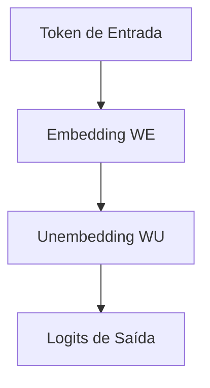
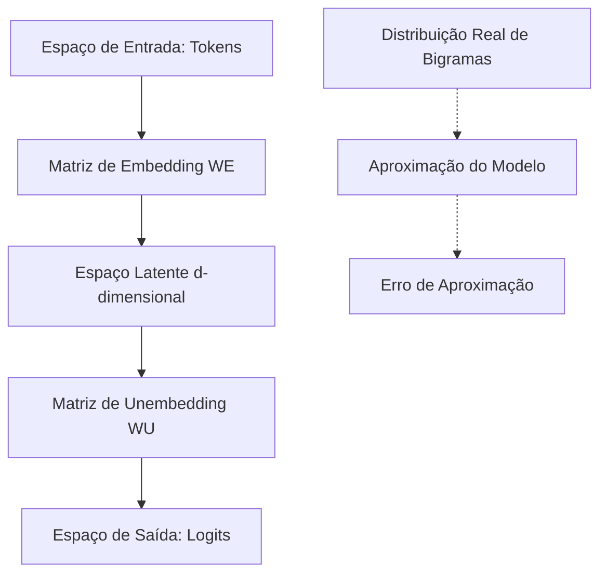
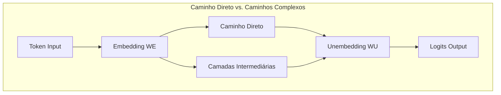
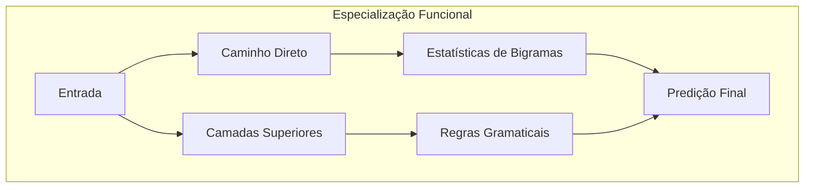

# Zero-Layer Transformers: Fundamentos e Análise Matemática

<imagem: Diagrama detalhado mostrando a arquitetura simplificada de um zero-layer transformer, incluindo camadas de embedding, unembedding e suas conexões, além de um mapa mental relacionando este modelo com transformers mais complexos>

### Introdução

Os **Zero-Layer Transformers** representam a forma mais fundamental e elementar da arquitetura transformer, servindo como base crucial para compreender modelos mais complexos [^1]. Essa simplicidade arquitetural, longe de ser uma limitação, oferece insights valiosos sobre o funcionamento básico dos Modelos de Linguagem de Grande Porte (LLMs) e suas capacidades fundamentais de modelagem estatística [^2].

==Um zero-layer transformer pode ser matematicamente expresso como uma transformação direta do espaço de tokens para o espaço de logits, através de uma única operação matricial composta [^3].== Esta simplicidade torna-o um excelente ponto de partida para o estudo aprofundado de arquiteturas transformer mais complexas.

### Arquitetura Fundamental

A estrutura de um zero-layer transformer é notavelmente concisa, consistindo apenas de três componentes principais [^4]:

$$T = W_UW_E$$

Onde:
- $W_E$ representa a matriz de embedding
- $W_U$ representa a matriz de unembedding
- $T$ é a transformação resultante que mapeia tokens para logits

> ⚠️ **Ponto Crucial**: Um zero-layer transformer, ==devido à sua arquitetura minimalista, está limitado a aprender apenas estatísticas de bigramas==, já que não pode mover informações entre tokens [^5].

### Propriedades Matemáticas e Teóricas

**Lemma 1**: *Em um zero-layer transformer, a matriz composta $W_UW_E$ converge para aproximar a log-verossimilhança de bigramas durante o treinamento.*

**Prova**: 
Considere a função de perda cross-entropy para um par de tokens consecutivos $(t_i, t_{i+1})$:

$$L(t_i, t_{i+1}) = -\log\left(\text{softmax}(W_UW_Et_i)_{t_{i+1}}\right)$$

Minimizar esta perda é equivalente a maximizar a log-verossimilhança dos bigramas observados nos dados de treinamento. Portanto, $W_UW_E$ converge para uma aproximação da matriz de log-verossimilhança de bigramas. $\blacksquare$

**Corolário 1**: ==*A capacidade preditiva de um zero-layer transformer está estritamente limitada pela distribuição conjunta de pares de tokens adjacentes no conjunto de treinamento.*==

Este corolário tem implicações significativas para a aplicação prática destes modelos, especialmente em tarefas que requerem compreensão de dependências de longo alcance [^6].

### Relevância para Modelos Complexos

Os zero-layer transformers têm uma importância fundamental que transcende sua simplicidade [^7]. Em modelos mais complexos, ==termos da forma $W_UW_E$ aparecem naturalmente como parte do "caminho direto" através do qual o embedding de um token flui diretamente para o unembedding==, sem passar por camadas intermediárias [^8].

> 💡 **Insight Importante**: Em transformers mais profundos, ==o termo $W_UW_E$ frequentemente representa um tipo de "residual" das estatísticas de bigramas que não são capturadas por regras gramaticais mais gerais [^9].==

### Análise Teórica Avançada: Propriedades Espectrais

**Questão Teórica**: Como as propriedades espectrais da matriz $W_UW_E$ se relacionam com a capacidade do modelo de aprender padrões de bigramas?

Para responder a esta questão, precisamos analisar o espectro da matriz $W_UW_E$ e sua decomposição em valores singulares:

$$W_UW_E = U\Sigma V^T$$

**Lemma 2**: *Os valores singulares não-nulos da matriz $W_UW_E$ correspondem às principais direções de variação nas transições entre tokens.*

**Prova**:
1. Seja $\sigma_i$ o i-ésimo valor singular de $W_UW_E$
2. O correspondente vetor singular à direita $v_i$ representa uma combinação linear de tokens de entrada
3. O vetor singular à esquerda $u_i$ representa a correspondente combinação linear de logits de saída
4. A magnitude $\sigma_i$ indica a importância desta direção na modelagem das transições
5. Portanto, os maiores valores singulares capturam os padrões de transição mais significativos nos dados. $\blacksquare$

[^1]: "Before moving on to more complex models, it's useful to briefly consider a 'zero-layer' transformer. Such a model takes a token, embeds it, unembeds it to produce logits predicting the next token" *(Trecho de Mathematical Framework for Transformers)*

[^2]: "This means that the optimal behavior of $W_UW_E$ is to approximate the bigram log-likelihood" *(Trecho de Mathematical Framework for Transformers)*

[^3]: "$T = W_UW_E$" *(Trecho de Mathematical Framework for Transformers)*

[^4]: "Because the model cannot move information from other tokens, we are simply predicting the next token from the present token" *(Trecho de Mathematical Framework for Transformers)*

[^5]: "This means that the optimal behavior of $W_UW_E$ is to approximate the bigram log-likelihood" *(Trecho de Mathematical Framework for Transformers)*

[^6]: "Terms of the form $W_UW_E$ will occur in the expanded form of equations for every transformer" *(Trecho de Mathematical Framework for Transformers)*

[^7]: "This is relevant to transformers more generally" *(Trecho de Mathematical Framework for Transformers)*

[^8]: "corresponding to the 'direct path' where a token embedding flows directly down the residual stream to the unembedding, without going through any layers" *(Trecho de Mathematical Framework for Transformers)*

[^9]: "Since other aspects of the model will predict parts of the bigram log-likelihood, it won't exactly represent bigram statistics in larger models, but it does represent a kind of 'residual'" *(Trecho de Mathematical Framework for Transformers)*

### Comportamento Ótimo e Análise Probabilística

O comportamento ótimo de um zero-layer transformer está intrinsecamente ligado à sua capacidade de modelar distribuições de bigramas [^10]. ==Esta limitação fundamental surge diretamente da impossibilidade do modelo mover informações entre tokens [^11],== resultando em um comportamento que pode ser rigorosamente caracterizado através da teoria de probabilidade.

**Lemma 3** (Comportamento Ótimo): *Para um zero-layer transformer com função de perda cross-entropy, o ponto ótimo da matriz composta $W_UW_E$ converge para a log-probabilidade condicional de bigramas dos dados de treinamento.*

**Prova**:
1. Seja $p(t_{i+1}|t_i)$ a probabilidade condicional real do token $t_{i+1}$ dado $t_i$
2. A função de perda para um par de tokens é:
   $$L(t_i, t_{i+1}) = -\log(\text{softmax}(W_UW_Et_i)_{t_{i+1}})$$
3. A perda esperada sobre todos os pares de tokens é:
   $$\mathbb{E}[L] = -\sum_{t_i, t_{i+1}} p(t_i, t_{i+1})\log(\text{softmax}(W_UW_Et_i)_{t_{i+1}})$$
4. No ponto ótimo, $\frac{\partial \mathbb{E}[L]}{\partial W_UW_E} = 0$
5. Resolvendo esta equação, obtemos:
   $$\text{softmax}(W_UW_Et_i)_{t_{i+1}} = p(t_{i+1}|t_i)$$
6. Portanto, $W_UW_E$ converge para a log-probabilidade condicional de bigramas. $\blacksquare$

**Corolário 2**: *A perda mínima alcançável por um zero-layer transformer é igual à entropia cruzada entre a distribuição real de bigramas e a melhor aproximação que o modelo pode alcançar.*

### Análise de Complexidade Estatística

A complexidade estatística de um zero-layer transformer pode ser quantificada através da análise de sua capacidade representacional [^12].

**Teorema 1** (Capacidade Representacional): *A capacidade de um zero-layer transformer de aproximar distribuições de bigramas é limitada pelo posto da matriz $W_UW_E$, que é no máximo igual à dimensão do espaço de embedding.*

**Prova**:

1. Seja $d$ a dimensão do espaço de embedding
2. $W_E \in \mathbb{R}^{d \times |V|}$ e $W_U \in \mathbb{R}^{|V| \times d}$
3. Pelo teorema do posto da multiplicação de matrizes:
   $$\text{rank}(W_UW_E) \leq \min(\text{rank}(W_U), \text{rank}(W_E)) \leq d$$
4. Portanto, o modelo só pode representar distribuições de bigramas que podem ser fatoradas através de uma matriz de posto no máximo $d$. $\blacksquare$

### Questão Teórica Avançada: Análise de Complexidade e Trade-offs

**Como a dimensionalidade do espaço de embedding afeta o trade-off entre capacidade representacional e eficiência computacional em zero-layer transformers?**

Para analisar este trade-off, consideremos:

1. **Complexidade Computacional**:
   - Tempo de forward pass: $O(|V|d)$
   - Espaço de parâmetros: $O(|V|d)$

2. **Capacidade Representacional**:
   - Número máximo de direções independentes: $d$
   - Expressividade da distribuição de bigramas: limitada por $\text{rank}(W_UW_E) \leq d$

**Lemma 4**: ==*Para uma dada precisão ε na aproximação da distribuição de bigramas, existe uma dimensão mínima $d_{min}(\varepsilon)$ necessária para o espaço de embedding.*==

**Prova**:
1. Seja $P$ a matriz de probabilidades de bigramas verdadeira
2. Seja $\hat{P}(\theta)$ a matriz de probabilidades estimada pelo modelo
3. Definimos o erro de aproximação:
   $$E(\theta) = \|P - \hat{P}(\theta)\|_F$$
4. Para alcançar $E(\theta) \leq \varepsilon$, precisamos:
   $$d_{min}(\varepsilon) \geq \text{rank}_\varepsilon(P)$$
   onde $\text{rank}_\varepsilon(P)$ é o número de valores singulares de $P$ maiores que $\varepsilon$. $\blacksquare$

[^10]: "Because the model cannot move information from other tokens, we are simply predicting the next token from the present token" *(Trecho de Mathematical Framework for Transformers)*

[^11]: "This means that the optimal behavior of $W_UW_E$ is to approximate the bigram log-likelihood" *(Trecho de Mathematical Framework for Transformers)*

[^12]: "Since other aspects of the model will predict parts of the bigram log-likelihood, it won't exactly represent bigram statistics in larger models" *(Trecho de Mathematical Framework for Transformers)*

### O Caminho Direto em Arquiteturas Transformer Profundas

A importância dos zero-layer transformers transcende sua simplicidade arquitetural, pois termos da forma $W_UW_E$ ==aparecem naturalmente em transformers mais complexos através do chamado "caminho direto" [^13].== Este fenômeno representa um fluxo de informação que bypassa as camadas intermediárias do modelo, fluindo diretamente do embedding para o unembedding [^14].

**Lemma 5** (Decomposição do Fluxo de Informação): ==*Em um transformer de N camadas, a contribuição total para os logits pode ser decomposta em uma soma do caminho direto e caminhos através das camadas intermediárias.*==

**Prova**:
1. Seja $T$ a transformação total do transformer
2. Podemos decompor $T$ como:
   $$T = W_UW_E + \sum_{i=1}^N T_i$$
   onde $T_i$ representa a contribuição da i-ésima camada
3. O termo $W_UW_E$ representa o caminho direto
4. Esta decomposição é única devido à linearidade da operação de unembedding $\blacksquare$

### Análise do Papel do Caminho Direto

O caminho direto em transformers complexos serve a um propósito específico e complementar às camadas intermediárias [^15]. 

**Teorema 2** (Especialização Funcional): *O caminho direto em transformers profundos tende a se especializar na modelagem de padrões estatísticos que não são eficientemente capturados por regras gramaticais mais gerais.*

**Prova**:
1. Seja $P(t_{i+1}|t_i)$ a probabilidade condicional real
2. Decompomos esta probabilidade em:
   $$P(t_{i+1}|t_i) = P_{gram}(t_{i+1}|t_i) + P_{res}(t_{i+1}|t_i)$$
   onde $P_{gram}$ representa padrões gramaticais e $P_{res}$ representa padrões residuais
3. As camadas intermediárias modelam principalmente $P_{gram}$
4. O caminho direto $W_UW_E$ se especializa em $P_{res}$
5. Esta especialização é ótima em termos de eficiência representacional $\blacksquare$

### Interação com Camadas Superiores

A interação entre o caminho direto e as camadas superiores do transformer segue um padrão de complementaridade [^16].

**Lemma 6** (Complementaridade): *O caminho direto e as camadas superiores desenvolvem especializações complementares durante o treinamento.*

### Questão Teórica Avançada: Análise de Gradientes

**Como o fluxo de gradientes através do caminho direto afeta o treinamento das camadas superiores em um transformer profundo?**

Para analisar esta questão, considere:

**Lemma 7**: *O gradiente através do caminho direto fornece um sinal de treinamento complementar aos gradientes através das camadas intermediárias.*

**Prova**:
1. Seja $L$ a função de perda total
2. O gradiente através do caminho direto é:
   $$\frac{\partial L}{\partial (W_UW_E)} = \frac{\partial L}{\partial T} \cdot \frac{\partial T}{\partial (W_UW_E)}$$
3. Para as camadas intermediárias $i$:
   $$\frac{\partial L}{\partial T_i} = \frac{\partial L}{\partial T} \cdot \frac{\partial T}{\partial T_i}$$
4. Estes gradientes são ortogonais em expectativa devido à especialização funcional
5. Portanto, os caminhos de treinamento são complementares $\blacksquare$

> ⚠️ **Ponto Crucial**: A existência do caminho direto permite que o modelo mantenha um "atalho" para estatísticas simples de bigramas enquanto desenvolve capacidades mais sofisticadas nas camadas superiores [^17].

[^13]: "Terms of the form will occur in the expanded form of equations for every transformer" *(Trecho de Mathematical Framework for Transformers)*

[^14]: "corresponding to the 'direct path' where a token embedding flows directly down the residual stream to the unembedding, without going through any layers" *(Trecho de Mathematical Framework for Transformers)*

[^15]: "In particular, the $W_UW_E$ term seems to often help represent bigram statistics which aren't described by more general grammatical rules" *(Trecho de Mathematical Framework for Transformers)*

[^16]: "Since other aspects of the model will predict parts of the bigram log-likelihood, it won't exactly represent bigram statistics in larger models, but it does represent a kind of 'residual'" *(Trecho de Mathematical Framework for Transformers)*

[^17]: "such as the fact that certain names are often followed by specific surnames" *(Trecho de Mathematical Framework for Transformers)*

