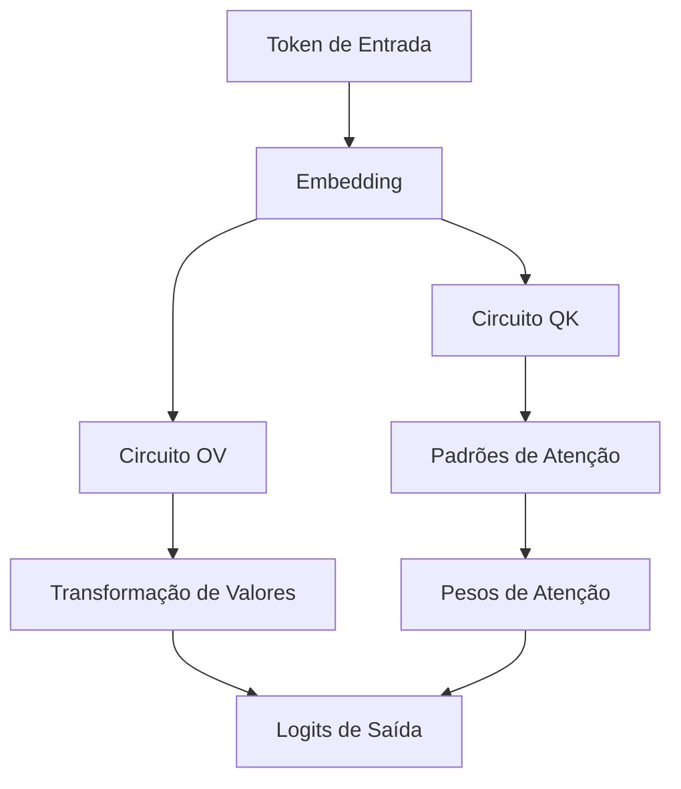
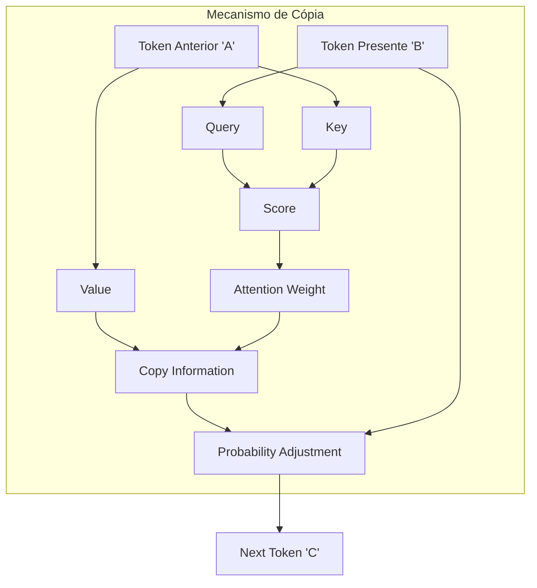
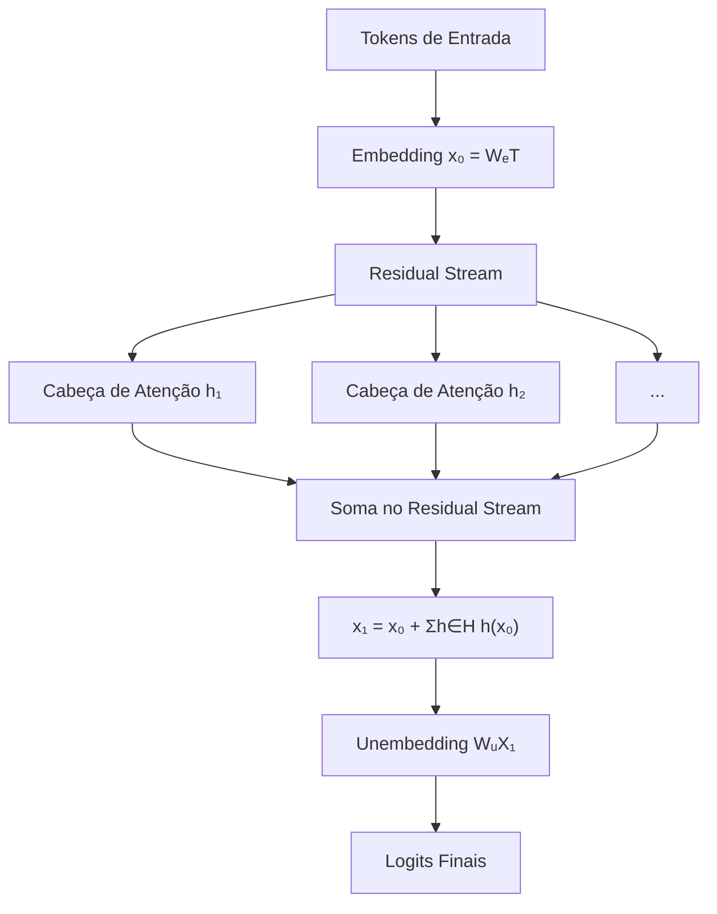
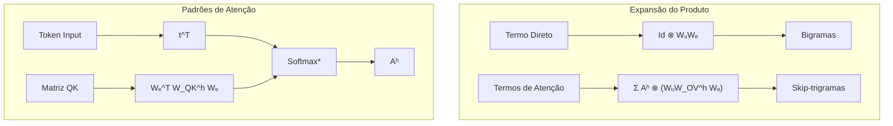
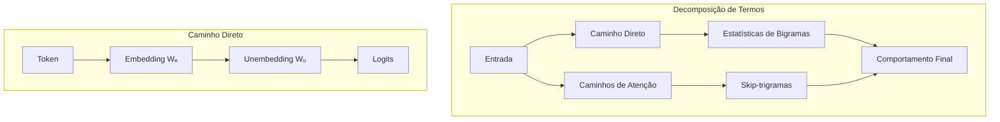

# Análise Teórica de Transformers de Uma Camada Baseados em Atenção

<imagem: Diagrama detalhado mostrando a arquitetura de um transformer de uma camada, destacando os componentes de atenção, as conexões skip-trigram e o fluxo de informação desde a entrada até a saída. O diagrama deve incluir visualizações das matrizes de peso e dos padrões de atenção, bem como exemplos de skip-trigrams sendo formados>

### Introdução

Os **transformers de uma camada baseados exclusivamente em atenção** representam uma classe fundamental de modelos que nos permitem compreender os princípios básicos do funcionamento dos Large Language Models (LLMs). ==Este capítulo apresenta uma análise teórica aprofundada de como esses modelos podem ser entendidos como um **ensemble de um modelo de bigramas e vários modelos de "skip-trigramas"** [^1].==

A importância deste estudo reside na capacidade de decompor um transformer aparentemente complexo em componentes interpretáveis, permitindo uma compreensão mais profunda dos mecanismos fundamentais de processamento de linguagem. Esta decomposição não apenas fornece insights teóricos valiosos, mas também estabelece uma base para entender modelos mais complexos [^2].

### 1. Estrutura Matemática Fundamental

==A base matemática para compreender transformers de uma camada começa com o **path expansion trick**, uma técnica que nos permite decompor o modelo em termos interpretáveis [^3].==

Um transformer de uma camada pode ser representado matematicamente como:

$$T = Id \otimes W_U \cdot \left(Id + \sum_{h \in H} A^h \otimes W_{OV}^h\right) \cdot Id \otimes W_E$$

onde:
- $W_U$ representa a matriz de unembedding
- $W_E$ representa a matriz de embedding
- $A^h$ são os padrões de atenção para cada cabeça h
- $W_{OV}^h$ são as matrizes de output-value para cada cabeça

**Lemma 1:** *Para um transformer de uma camada, o produto dos termos pode ser expandido em uma soma onde cada termo corresponde a um caminho end-to-end através do modelo.*

**Prova:**
Aplicando a propriedade distributiva e as regras do produto tensorial:

$$T = Id \otimes W_U W_E + \sum_{h \in H} A^h \otimes (W_U W_{OV}^h W_E)$$

==onde o primeiro termo representa o "caminho direto" e os termos subsequentes representam os efeitos das cabeças de atenção. $\blacksquare$==

> 📐 **Comentário Avançado:** A representação matemática do transformer como $T = Id \otimes W_U \cdot \left(Id + \sum_{h \in H} A^h \otimes W_{OV}^h\right) \cdot Id \otimes W_E$ destaca a essência linear das operações internas do modelo. **Geometricamente, o "path expansion trick" permite que visualizemos o fluxo de informação como caminhos distintos através de espaços vetoriais de alta dimensão, onde cada caminho corresponde a uma transformação linear específica aplicada aos embeddings dos tokens.** Essa perspectiva facilita a decomposição do modelo em componentes interpretáveis, onde as cabeças de atenção atuam como projeções que modificam a direção e magnitude dos vetores no espaço, contribuindo individualmente para a saída final.

### 2. Análise dos Circuitos QK e OV

Um aspecto crucial para entender o funcionamento dos transformers de uma camada é a separação dos circuitos Query-Key (QK) e Output-Value (OV) [^4]. 

Para cada cabeça de atenção h, temos dois componentes principais:

1. **Circuito QK:** $W_E^T W_Q^T W_K W_E$ - Determina os scores de atenção entre tokens
2. **Circuito OV:** $W_U W_O^T W_V W_E$ - Define como um token afeta os logits se for atendido

**Corolário 1:** ==*O padrão de atenção é uma função tanto do token fonte quanto do token destino, mas uma vez que um token destino decidiu quanto atender a um token fonte, o efeito na saída é unicamente função do token fonte.*==

> 📐 **Comentário Avançado:** A separação dos circuitos Query-Key (QK) e Output-Value (OV) reflete a dualidade fundamental nas operações de atenção em **Álgebra Linear**. ==**Geometricamente, o circuito QK calcula a similaridade entre tokens no espaço vetorial, avaliando quão alinhados estão os vetores de query e key, enquanto o circuito OV transforma os vetores de valor dos tokens atendidos, influenciando a saída do modelo.**== Essa distinção permite compreender como o modelo determina quais tokens são relevantes (através de projeções e medidas de similaridade) e como essas informações são incorporadas na predição final, enfatizando a importância das transformações lineares na captura de relações contextuais.

### 3. Skip-Trigramas e Sua Interpretação

Os **skip-trigramas** são sequências da forma [fonte]... [destino][saída], onde o modelo aprende a modificar as probabilidades da [saída] baseado nas relações entre [fonte] e [destino] [^5].

> ⚠️ **Ponto Crucial**: As matrizes expandidas QK e OV podem ter bilhões de entradas, transformando efetivamente o modelo em uma "sala chinesa" comprimida.

Considere o seguinte exemplo de skip-trigrama:

$$\text{[perfect]... [are] → [perfect]}$$
$$\text{[perfect]... [looks] → [super]}$$

Este padrão demonstra como o modelo pode aprender tanto a copiar tokens quanto a predizer continuações semanticamente apropriadas [^6].

> 📐 **Comentário Avançado:** Os **skip-trigramas** ampliam a capacidade dos transformers de capturar dependências não adjacentes, essenciais para modelar a linguagem natural. ==**Geometricamente, isso representa a capacidade do modelo de conectar pontos distantes no espaço vetorial dos embeddings, criando "atalhos" que permitem a transferência de informação entre tokens separados por várias posições.**== A expansão das matrizes QK e OV em dimensões elevadas reflete a riqueza de padrões que o modelo pode aprender, onde cada entrada na matriz corresponde a uma possível interação entre tokens. Essa estrutura matricial massiva é manipulada eficientemente graças às propriedades das transformações lineares e à esparsidade das atenções aprendidas.

[^1]: "We claim that one-layer attention-only transformers can be understood as an ensemble of a bigram model and several 'skip-trigram' models (affecting the probabilities of sequences 'A... BC')." *(Trecho de A Mathematical Framework for Transformer Circuits)*

[^2]: "The goal of this section is to rigorously show this correspondence, and demonstrate how to convert the raw weights of a transformer into interpretable tables of skip-trigram probability adjustments." *(Trecho de A Mathematical Framework for Transformer Circuits)*

[^3]: "Our key trick is to simply expand the product. This transforms the product (where every term corresponds to a layer), into a sum where every term corresponds to an end-to-end path." *(Trecho de A Mathematical Framework for Transformer Circuits)*

[^4]: "For each attention head h we have a term A^h ⊗ (W_U W_{OV}^h W_E) where A^h = softmax (t^T · W_E^T W_{QK}^h W_E · t). How can we map these terms to model behavior?" *(Trecho de A Mathematical Framework for Transformer Circuits)*

[^5]: "By multiplying out the OV and QK circuits, we've succeeded in doing this: the neural network parameters are now simple linear or bilinear functions on tokens." *(Trecho de A Mathematical Framework for Transformer Circuits)*

[^6]: "One of the most striking things about looking at these matrices is that most attention heads in one layer models dedicate an enormous fraction of their capacity to copying." *(Trecho de A Mathematical Framework for Transformer Circuits)*

### 4. Mecanismo de Atenção Seletiva e Ajuste de Probabilidades

==O poder dos transformers de uma camada reside em sua capacidade de **atenção seletiva**, onde cada cabeça de atenção pode atender seletivamente do token presente ("B") a um token anterior ("A") e copiar informações para ajustar a probabilidade de possíveis tokens seguintes ("C") [^7].==

Este mecanismo pode ser formalizado matematicamente da seguinte forma:

$$p(C|B,A) = \text{softmax}(W_U(W_O W_V(A_{att}x_A) + x_B))$$

onde:
- $x_A$ e $x_B$ são os embeddings dos tokens A e B
- $A_{att}$ é o padrão de atenção que determina quanto B atende a A
- $W_O W_V$ é a matriz que controla como a informação é copiada

**Lemma 2:** *A capacidade de ajuste de probabilidade de um transformer de uma camada é limitada pela dimensionalidade do espaço de embedding e pelo número de cabeças de atenção.*

**Prova:**
Seja $d$ a dimensionalidade do embedding e $h$ o número de cabeças de atenção. O espaço de transformações possíveis é limitado por:

1. Dimensão do espaço de embedding: $\mathbb{R}^d$
2. Rank máximo das matrizes $W_O W_V$: $\min(d, d_{head})$
3. Número total de transformações independentes: $h$

Portanto, o espaço total de ajustes possíveis é limitado por $h \cdot \min(d, d_{head})$. $\blacksquare$

> 📐 **Comentário Avançado:** A capacidade de **atenção seletiva** dos transformers é um testemunho do poder das projeções lineares em espaços de alta dimensão. ==**Geometricamente, cada cabeça de atenção atua como um filtro direcional, focando em componentes específicas dos vetores de embedding que são relevantes para a tarefa corrente.**== O Lema 2 ressalta que a capacidade do modelo de ajustar probabilidades está intrinsecamente ligada ao rank das matrizes de projeção e ao espaço disponível para representar variações nos dados. Isso reflete a importância da dimensionalidade e do número de cabeças de atenção em fornecer ao modelo a flexibilidade necessária para capturar padrões complexos na linguagem.

### 5. Arquitetura Detalhada do Mecanismo de Cópia

O **mecanismo de cópia** opera através de três componentes principais [^8]:

1. **Componente de Query-Key:**
   $$\text{score}(B,A) = \frac{q_B^T k_A}{\sqrt{d_k}}$$
   onde $q_B$ é o vetor de query do token B e $k_A$ é o vetor de key do token A.

2. **Componente de Value:**
   $$v_{copied} = \alpha_{BA} W_V x_A$$
   onde $\alpha_{BA}$ é o peso de atenção normalizado.

3. **Componente de Output:**
   $$\Delta p(C) = W_U W_O v_{copied}$$
   que representa o ajuste na probabilidade do próximo token C.

> ✔️ **Insight Importante**: A eficiência deste mecanismo depende da capacidade do modelo em aprender matrizes $W_O W_V$ que preservem informações relevantes durante a cópia.
>
> 📐 **Comentário Avançado:** O **mecanismo de cópia** ilustra como os transformers podem replicar informações importantes de tokens anteriores para influenciar a predição atual. **Geometricamente, isso equivale a projetar o vetor de embedding de um token anterior ao longo de direções determinadas pelos vetores de atenção, e então combinar essa projeção com o vetor do token atual para ajustar a probabilidade de saída.** Essa operação envolve uma série de transformações lineares que permitem a transferência e modulação de informações no espaço vetorial, demonstrando a eficiência das operações matriciais em capturar dependências sequenciais.

### 6. Análise Teórica da Composição de Bigramas e Skip-Trigramas

**Teorema 1:** *Em um transformer de uma camada, a probabilidade final de um token C pode ser decomposta em:*

$$p(C|contexto) = p_{bigram}(C|B) + \sum_{A \in contexto} p_{skip}(C|A,B)$$

onde:
- $p_{bigram}(C|B)$ vem do termo direto $W_U W_E$
- $p_{skip}(C|A,B)$ vem dos termos de atenção

**Prova:**
1. Do path expansion trick, temos:
   $$T = Id \otimes W_U W_E + \sum_{h \in H} A^h \otimes (W_U W_{OV}^h W_E)$$

2. Para um token específico C:
   $$\log p(C) = (W_U W_E)_C + \sum_{h \in H} \sum_{A \in contexto} \alpha_{BA}^h (W_U W_{OV}^h W_E)_C$$

3. O primeiro termo corresponde ao modelo de bigramas, e a soma corresponde aos skip-trigramas. $\blacksquare$

[^7]: "Intuitively, this is because each attention head can selectively attend from the present token ('B') to a previous token ('A') and copy information to adjust the probability of possible next tokens ('C')." *(Trecho de A Mathematical Framework for Transformer Circuits)*

[^8]: "The attention pattern is a function of both the source and destination token, but once a destination token has decided how much to attend to a source token, the effect on the output is solely a function of that source token." *(Trecho de A Mathematical Framework for Transformer Circuits)*

### 7. O Path Expansion Trick: Uma Análise Aprofundada

O **Path Expansion Trick** é uma técnica matemática fundamental que nos permite decompor um transformer de uma camada em seus componentes essenciais [^9]. A arquitetura básica consiste em três estágios principais:

1. **Token Embedding:**
   $$x_0 = W_Et$$

2. **Camada de Atenção:**
   $$x_1 = x_0 + \sum_{h \in H} h(x_0)$$

3. **Unembedding para Logits:**
   $$T(t) = W_Ux_1$$

**Lemma 3:** *O fluxo de informação em um transformer de uma camada pode ser representado como uma composição de transformações lineares e não-lineares, ==onde a única não-linearidade está na função softmax dos padrões de atenção.==*

**Prova:**

1. O embedding é linear: $x_0 = W_Et$
2. Cada cabeça de atenção h pode ser decomposta em:
   - Transformação linear para queries e keys
   - Softmax (não-linear)
   - Transformação linear para values
3. A soma no residual stream é linear
4. O unembedding é linear
  Portanto, a única não-linearidade está na função softmax. $\blacksquare$

> 📐 **Comentário Avançado:** O **Path Expansion Trick** destaca que a maior parte das operações em um transformer de uma camada são lineares, com a não-linearidade confinada à função softmax na atenção. ==**Geometricamente, isso significa que o fluxo de informação pode ser rastreado através de transformações lineares no espaço vetorial, permitindo que trajetórias distintas de processamento sejam identificadas e analisadas.**== Essa característica facilita a compreensão de como a informação é combinada e transformada ao longo do modelo, já que as operações lineares preservam a estrutura do espaço e permitem a aplicação direta de técnicas analíticas da Álgebra Linear.

### 8. Representação Tensorial do Transformer

Usando notação tensorial, podemos representar o transformer como um produto de três termos fundamentais [^10]:

$$T = Id \otimes W_U \cdot \left(Id + \sum_{h \in H} A^h \otimes W_{OV}^h\right) \cdot Id \otimes W_E$$

Este formato tensorial nos permite:

1. **Separar Operações Espaciais e de Feature:**
   - $Id$ opera no espaço posicional
   - $W_U$, $W_{OV}^h$, $W_E$ operam no espaço de features

2. **Identificar Caminhos de Informação:**
   - Caminho direto: $Id \otimes W_U W_E$
   - Caminhos de atenção: $A^h \otimes (W_U W_{OV}^h W_E)$

> ⚠️ **Observação Importante**: A notação tensorial revela que cada cabeça de atenção opera independentemente e suas contribuições são somadas no residual stream.

**Corolário 2:** *A expansão do produto tensorial resulta em termos que correspondem a diferentes caminhos através do modelo, cada um contribuindo para diferentes aspectos do processamento de linguagem.*

**Prova Esquemática:**
1. O termo direto $Id \otimes W_U W_E$ captura estatísticas de bigramas
2. Os termos de atenção $A^h \otimes (W_U W_{OV}^h W_E)$ capturam skip-trigramas
3. A soma desses termos permite que o modelo combine diferentes tipos de informação contextual. $\blacksquare$

> 📐 **Comentário Avançado:** A representação tensorial do transformer permite separar claramente as operações que atuam nos espaços posicionais das que atuam nos espaços de características. **Geometricamente, isso equivale a considerar o espaço de estados do modelo como um produto tensorial de espaços vetoriais, onde transformações lineares podem ser aplicadas independentemente em cada componente.** Essa separação facilita a análise das interações entre posições na sequência e das transformações aplicadas aos embeddings dos tokens, proporcionando uma visão mais estruturada e modular do funcionamento interno do modelo.

[^9]: "Recall that a one-layer attention-only transformer consists of a token embedding, followed by an attention layer (which independently applies attention heads), and finally an unembedding." *(Trecho de A Mathematical Framework for Transformer Circuits)*

[^10]: "Using tensor notation and the alternative representation of attention heads we previously derived, we can represent the transformer as a product of three terms." *(Trecho de A Mathematical Framework for Transformer Circuits)*

### 9. Expansão do Produto e Análise dos Termos

A expansão do produto do transformer nos fornece uma decomposição fundamental que transforma um produto de camadas em uma soma de caminhos end-to-end [^11]. Esta expansão pode ser escrita como:

$$T = \text{Id} \otimes W_U W_E + \sum_{h \in H} A^h \otimes (W_U W_{OV}^h W_E)$$

Cada componente tem uma interpretação específica:

1. **Token Unembedding ($\text{Id} \otimes W_U$):**
   - Mapeia vetores do residual stream para logits
   - Mantém a estrutura posicional através do $\text{Id}$

2. **Camada de Atenção ($\text{Id} + \sum_{h \in H} A^h \otimes W_{OV}^h$):**
   - Cada cabeça opera independentemente
   - Resultados são somados no residual stream
   - $A^h$ controla o padrão de atenção

3. **Token Embedding ($\text{Id} \otimes W_E$):**
   - Mapeia tokens para vetores do residual stream
   - Preserva estrutura posicional

**Lemma 4:** *O padrão de atenção $A^h$ para cada cabeça é determinado por uma forma bilinear nos tokens de entrada.*

**Prova:**
$$A^h = \text{softmax}^*(t^T \cdot W_E^T W_{QK}^h W_E \cdot t)$$

1. $W_E^T W_{QK}^h W_E$ define uma forma bilinear
2. O produto com $t$ em ambos os lados produz scores de atenção
3. softmax* normaliza os scores com masking autoregressive
$\blacksquare$

### 10. Análise dos Padrões de Atenção

Os **padrões de atenção** são produzidos multiplicando pares de tokens através de diferentes lados de $W_{QK}^h$ [^12]:

$$A^h = \text{softmax}^*(t^T \cdot W_E^T W_{QK}^h W_E \cdot t)$$

> 💡 **Insight Crítico**: O uso de softmax com masking autoregressive ($\text{softmax}^*$) garante que cada token só pode atender a tokens anteriores ou a si mesmo.

**Corolário 3:** *A capacidade do modelo de capturar dependências de longo alcance é limitada pela composição das matrizes de embedding e QK.*

Seja $v_i$ o embedding do token i e $W_{QK}^h$ a matriz QK da cabeça h. A força da dependência entre os tokens i e j é proporcional a:

$$\text{score}(i,j) = v_i^T W_{QK}^h v_j$$

Esta formulação nos permite analisar:
1. Como diferentes tokens podem interagir
2. Quais padrões linguísticos podem ser capturados
3. Limitações estruturais do modelo

> 📐 **Comentário Avançado:** Os padrões de atenção resultantes da multiplicação de pares de tokens através de $WQKhW_{QK}^hWQKh$ enfatizam o papel das formas bilineares em **Álgebra Linear**. **Geometricamente, o cálculo das pontuações de atenção pode ser visto como a avaliação da similaridade entre vetores de embeddings projetados, onde $WQKhW_{QK}^hWQKh$ atua como uma transformação que realça certas direções no espaço vetorial.** Isso permite que o modelo capture relações específicas entre tokens, baseando-se em características aprendidas durante o treinamento, e demonstra como operações bilineares são fundamentais para a funcionalidade dos mecanismos de atenção.

[^11]: "Our key trick is to simply expand the product. This transforms the product (where every term corresponds to a layer), into a sum where every term corresponds to an end-to-end path." *(Trecho de A Mathematical Framework for Transformer Circuits)*

[^12]: "Attention pattern logits are produced by multiplying pairs of tokens through different sides of W^h_QK." *(Trecho de A Mathematical Framework for Transformer Circuits)*

### 11. Análise dos Termos End-to-End e Suas Contribuições

O comportamento global do modelo pode ser compreendido através da análise independente de cada termo do path expansion, que se combinam aditivamente para criar o comportamento final do modelo [^13]. Esta decomposição nos permite uma análise tratável e sistemática.

#### 11.1 O Termo do Caminho Direto

O termo do **caminho direto** ($\text{Id} \otimes W_U W_E$) é especialmente interessante porque:

1. É idêntico ao termo encontrado em transformers de zero camadas
2. Não move informação entre posições (devido ao $\text{Id}$)
3. Contribui exclusivamente para estatísticas de bigramas [^14]

**Teorema 2:** *O termo do caminho direto $\text{Id} \otimes W_U W_E$ aproxima a log-probabilidade de bigramas do corpus de treinamento.*

**Prova:**
1. Seja $p(w_j|w_i)$ a probabilidade real de bigrama no corpus
2. O termo direto produz logits: $l_{ij} = (W_U W_E)_{ij}$
3. Minimizar a cross-entropy resulta em:
   $$l_{ij} \approx \log p(w_j|w_i) + c$$
   onde c é uma constante de normalização
   $\blacksquare$

#### 11.2 Princípio da Aditividade

**Lemma 5:** *Os diferentes termos do path expansion podem ser analisados independentemente e suas contribuições se somam linearmente para produzir o comportamento final do modelo.*

**Prova:**
1. Seja $T$ o transformer completo:
   $$T = T_{direct} + \sum_{h \in H} T_h$$
   onde $T_{direct}$ é o termo direto e $T_h$ são os termos de atenção

2. Para qualquer sequência de entrada x:
   $$T(x) = T_{direct}(x) + \sum_{h \in H} T_h(x)$$

3. Os logits finais são a soma das contribuições individuais:
   $$l_{final} = l_{direct} + \sum_{h \in H} l_h$$
   $\blacksquare$

> ⚠️ **Ponto Crucial**: A linearidade da soma permite que cada termo seja otimizado de forma relativamente independente durante o treinamento.

#### 11.3 Preenchimento de Lacunas

Um aspecto importante do termo direto é sua capacidade de preencher lacunas não capturadas pelos outros termos [^15]. Isto ocorre porque:

1. O termo direto pode aprender estatísticas de bigramas que são:
   - Muito específicas para serem capturadas por cabeças de atenção
   - Não seguem padrões regulares de skip-trigramas

2. Durante o treinamento, o termo direto se adapta para complementar as cabeças de atenção:
   $$W_U W_E \approx \log p(w_j|w_i) - \sum_{h \in H} \mathbb{E}[l_h(w_i, w_j)]$$
   onde $\mathbb{E}[l_h(w_i, w_j)]$ é a contribuição média da cabeça h para o bigrama $(w_i, w_j)$

[^13]: "We claim each of these end-to-end path terms is tractable to understand, can be reasoned about independently, and additively combine to create model behavior." *(Trecho de A Mathematical Framework for Transformer Circuits)*

[^14]: "The direct path term also occurred when we looked at the zero-layer transformer. Because it doesn't move information between positions (that's what Id ⊗ ... denotes!), the only thing it can contribute to is the bigram statistics" *(Trecho de A Mathematical Framework for Transformer Circuits)*

[^15]: "and it will fill in missing gaps that other terms don't handle there." *(Trecho de A Mathematical Framework for Transformer Circuits)*
