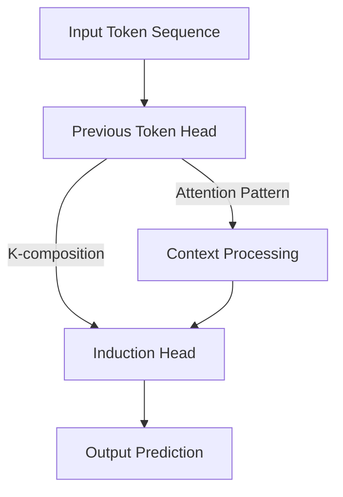
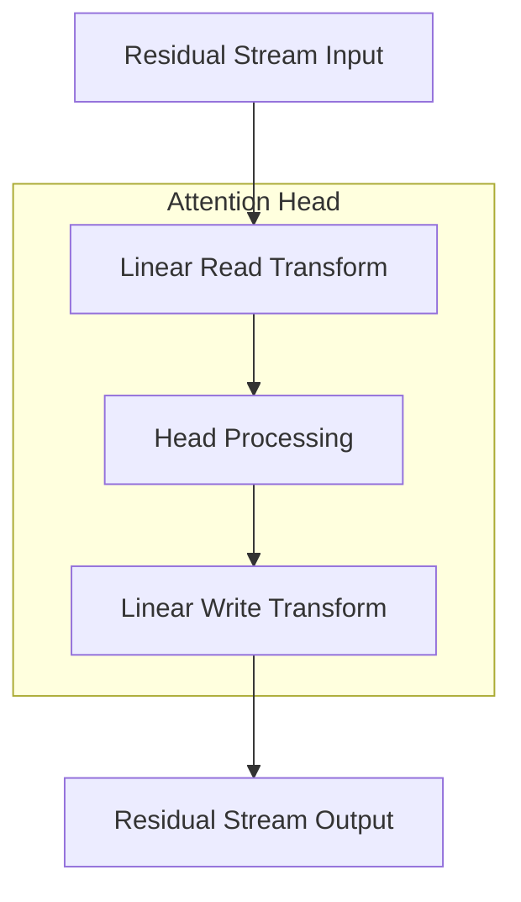
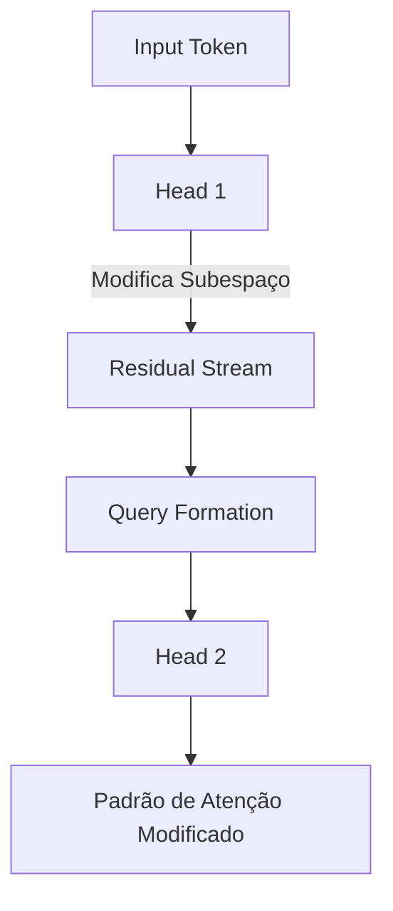
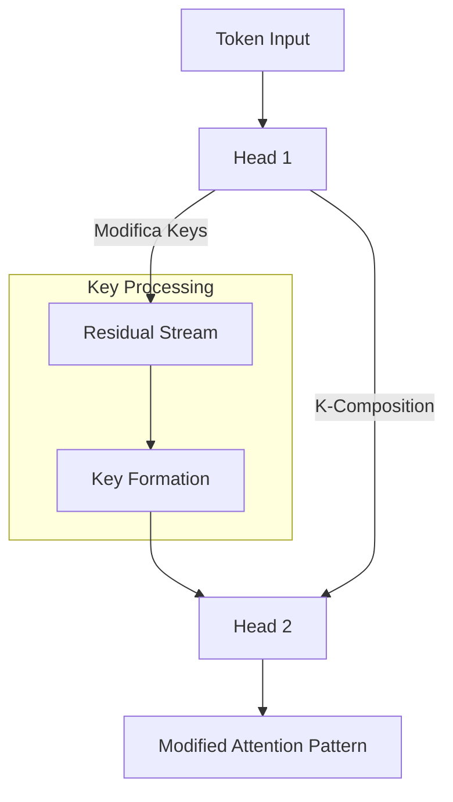
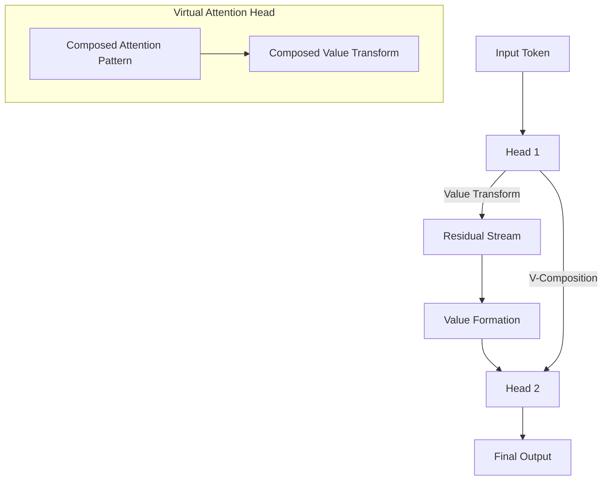

# Composição de Attention Heads em Transformers: Uma Análise da Diferença entre Modelos de Uma e Duas Camadas

<imagem: Diagrama complexo mostrando a arquitetura comparativa entre transformers de uma e duas camadas, destacando os diferentes tipos de composição de attention heads (Q-composition, K-composition e V-composition), com setas coloridas indicando os fluxos de informação e as interações entre as camadas>

### Introdução

A compreensão profunda dos **Modelos de Linguagem de Grande Porte (LLMs)** baseados em transformers requer uma análise detalhada de sua arquitetura fundamental, com especial atenção à composição de attention heads. Uma descoberta crucial no campo é que a diferença fundamental entre transformers de uma e duas camadas reside na capacidade de composição das attention heads [^1]. Esta distinção não é meramente estrutural, mas representa uma evolução qualitativa na capacidade computacional e expressiva destes modelos.

==A composição de attention heads permite que transformers de duas camadas implementem algoritmos substancialmente mais complexos através da composição de heads, superando significativamente as limitações dos modelos de camada única [^2].== Este avanço é particularmente evidente na capacidade dos modelos de duas camadas de realizar aprendizado em contexto (in-context learning) de maneira muito mais sofisticada.

### Fundamentos da Composição de Attention Heads

Em um transformer, existem três tipos fundamentais de composição de attention heads:

**Q-Composition (Composição de Query)**: Ocorre quando $W_Q$ lê um subespaço afetado por uma head anterior.

**K-Composition (Composição de Key)**: Acontece quando $W_K$ lê um subespaço afetado por uma head anterior.

**V-Composition (Composição de Value)**: Ocorre quando $W_V$ lê um subespaço afetado por uma head anterior [^3].

A distinção entre estas composições é crucial: Q e K-Composition afetam o padrão de atenção, permitindo que attention heads expressem padrões muito mais complexos. Por outro lado, V-Composition afeta quais informações uma attention head move quando atende a uma determinada posição [^4].

Matematicamente, podemos expressar a composição através da seguinte formulação:

$$T = Id \otimes W_U \cdot \left(Id + \sum_{h \in H_2} A^h \otimes W_{OV}^h\right) \cdot \left(Id + \sum_{h \in H_1} A^h \otimes W_{OV}^h\right) \cdot Id \otimes W_E$$

onde $H_1$ e $H_2$ representam as attention heads da primeira e segunda camada, respectivamente [^5].

### Induction Heads: O Poder da Composição

Um dos aspectos mais notáveis da composição em transformers de duas camadas é a emergência de **induction heads**. Estas estruturas representam um mecanismo muito mais poderoso para implementar aprendizado em contexto comparado aos modelos de uma camada [^6].

**Lemma 1 (Composição de Induction Heads)**: *Uma induction head em um transformer de duas camadas pode ser construída através da K-composição com uma previous token head para deslocar o vetor key em uma posição.*

**Prova**: Considere o termo $Id \otimes A^{h-1} \otimes W$ no circuito QK. Se $W$ corresponde a casos onde os tokens são iguais, então este termo aumentará os scores de atenção quando o token anterior à posição fonte for igual ao token destino [^7]. $\blacksquare$

### Teoria da Expansão de Caminhos em Transformers de Duas Camadas

A análise da composição em transformers de duas camadas pode ser realizada através da **expansão de caminhos**, que transforma o produto (onde cada termo corresponde a uma camada) em uma soma onde cada termo corresponde a um caminho fim-a-fim através do modelo [^8].

[^1]: "Composition of attention heads is the key difference between one-layer and two-layer attention-only transformers. Without composition, a two-layer model would simply have more attention heads to implement skip-trigrams with." *(Trecho de Mathematical Framework for Transformers)*

[^2]: "We'll see that in practice, two-layer models discover ways to exploit attention head composition to express a much more powerful mechanism for accomplishing in-context learning." *(Trecho de Mathematical Framework for Transformers)*

[^3]: "When attention heads do compose, there are three options: Q-Composition: WQ reads in a subspace affected by a previous head. K-Composition: WK reads in a subspace affected by a previous head. V-Composition: WV reads in a subspace affected by a previous head." *(Trecho de Mathematical Framework for Transformers)*

[^4]: "Q- and K-Composition are quite different from V-Composition. Q- and K-Composition both affect the attention pattern, allowing attention heads to express much more complex patterns." *(Trecho de Mathematical Framework for Transformers)*

[^5]: "T = Id ⊗ WU · (Id + ∑h∈H2 Ah ⊗ WhOV) · (Id + ∑h∈H1 Ah ⊗ WhOV) · Id ⊗ WE" *(Trecho de Mathematical Framework for Transformers)*

[^6]: "Induction heads are a much more powerful mechanism for achieving in-context learning." *(Trecho de Mathematical Framework for Transformers)*

[^7]: "The minimal way to create an induction head is to use K-composition with a previous token head to shift the key vector forward one token. This creates a term of the form Id ⊗ A^h-1 ⊗ W in the QK-circuit" *(Trecho de Mathematical Framework for Transformers)*

[^8]: "Our key trick is to simply expand the product. This transforms the product (where every term corresponds to a layer), into a sum where every term corresponds to an end-to-end path." *(Trecho de Mathematical Framework for Transformers)*

### Residual Stream como Canal de Comunicação

Uma das características fundamentais dos transformers é o conceito do **residual stream** como um canal de comunicação. Este mecanismo permite que diferentes componentes do modelo interajam de maneira estruturada e controlada [^9].

O residual stream possui uma estrutura profundamente linear, onde cada camada:
1. Realiza uma transformação linear arbitrária para "ler" informações do stream
2. Executa seu processamento interno
3. Realiza outra transformação linear para "escrever" seu output de volta ao stream [^10]

**Lemma 2 (Dimensionalidade do Residual Stream)**: *Seja d a dimensionalidade do residual stream e d_head a dimensionalidade de uma attention head. Como d_head << d, cada attention head opera em um subespaço de dimensão muito menor que o espaço total do residual stream.*

**Prova**: Em transformers típicos, d_head/d varia de 1/10 a 1/100, o que implica que cada attention head opera em um subespaço que representa apenas uma pequena fração do espaço total, permitindo que múltiplas heads operem sem interferência significativa [^11]. $\blacksquare$

### Subspaces e Bandwidth do Residual Stream

O residual stream possui uma característica notável: ==sua alta dimensionalidade permite que diferentes camadas enviem informações distintas para diferentes camadas subsequentes, armazenando-as em subespaços diferentes [^12].== Este conceito é fundamental para entender como a composição de attention heads funciona em transformers de múltiplas camadas.

> ⚠️ **Ponto Crucial**: As dimensões do residual stream funcionam como uma espécie de "memória" ou "bandwidth". Uma vez que uma informação é adicionada a um subespaço, ela persiste até que outra camada ativamente a delete [^13].

A demanda por bandwidth no residual stream é particularmente alta, pois existem geralmente muito mais "dimensões computacionais" (como neurônios e dimensões de resultado das attention heads) do que dimensões no residual stream. Por exemplo:

$$\text{Dimensões de MLP} \approx 4 \times \text{Dimensões do Residual Stream}$$

Esta relação cria um interessante gargalo de comunicação [^14].

[^9]: "The residual stream is simply the sum of the output of all the previous layers and the original embedding. We generally think of the residual stream as a communication channel, since it doesn't do any processing itself and all layers communicate through it." *(Trecho de Mathematical Framework for Transformers)*

[^10]: "The residual stream has a deeply linear structure. Every layer performs an arbitrary linear transformation to 'read in' information from the residual stream at the start, and performs another arbitrary linear transformation before adding to 'write' its output back into the residual stream." *(Trecho de Mathematical Framework for Transformers)*

[^11]: "Since the attention head vectors are much smaller than the size of the residual stream (typical values of d_head/d_model might vary from around 1/10 to 1/100), attention heads operate on small subspaces and can easily avoid significant interaction." *(Trecho de Mathematical Framework for Transformers)*

[^12]: "The residual stream is a high-dimensional vector space...This means that layers can send different information to different layers by storing it in different subspaces." *(Trecho de Mathematical Framework for Transformers)*

[^13]: "Once added, information persists in a subspace unless another layer actively deletes it. From this perspective, dimensions of the residual stream become something like 'memory' or 'bandwidth'." *(Trecho de Mathematical Framework for Transformers)*

[^14]: "There are generally far more 'computational dimensions' (such as neurons and attention head result dimensions) than the residual stream has dimensions to move information. Just a single MLP layer typically has four times more neurons than the residual stream has dimensions." *(Trecho de Mathematical Framework for Transformers)*

### Análise Teórica da Q-Composition

A **Q-Composition** representa um dos mecanismos fundamentais de composição em transformers de duas camadas, onde $W_Q$ lê um subespaço que foi afetado por uma head anterior [^15]. Este mecanismo permite uma forma sofisticada de processamento de informação que vai além da simples atenção direta.

#### Formulação Matemática da Q-Composition

Para entender a Q-Composition formalmente, precisamos analisar como o circuito QK se expande em termos de tokens em vez de attention heads. A expansão do circuito QK para uma head da segunda camada pode ser expressa como:

$$C_{QK}^{h \in H_2} = \left(\text{Id}\otimes\text{Id}\otimes W_E^T + \sum_{h_k \in H_1} A^{h_k}\otimes\text{Id}\otimes(W_{OV}^{h_k}W_E)^T\right) \cdot \text{Id}\otimes\text{Id}\otimes W_{QK}^h$$

onde os termos de Q-Composition são representados por $A^{h_q} \otimes \text{Id} \otimes (W_E^T W_{OV}^{h_q T} W_{QK}^h W_E)$ [^16].

**Lemma 3 (Propriedade Fundamental da Q-Composition)**: *Em uma Q-Composition, o padrão de atenção resultante depende não apenas dos tokens atuais, mas também da informação processada pela head anterior através do subespaço afetado.*

**Prova**: 
1. Seja x o vetor de input no residual stream
2. A head anterior h₁ produz uma saída que afeta um subespaço: $h_1(x) = A^{h_1} \otimes W_{OV}^{h_1}$
3. A query da segunda head h₂ é computada como: $q = W_Q(x + h_1(x))$
4. Portanto, a query incorpora informação tanto do input direto quanto da transformação pela head anterior [^17]. $\blacksquare$

### Impacto da Q-Composition na Expressividade do Modelo

A Q-Composition permite que o modelo desenvolva padrões de atenção mais sofisticados por duas razões principais:

1. **Processamento Hierárquico**: ==A segunda head pode basear suas queries em informações já processadas pela primeira head, criando uma forma de hierarquia no processamento de informação [^18].==

2. **Expansão do Campo Receptivo**: As queries podem ser influenciadas por um contexto mais amplo, já que incorporam informações processadas por heads anteriores.

**Corolário 1**: *A Q-Composition aumenta o campo receptivo efetivo de uma attention head, permitindo que ela baseie suas decisões de atenção em um contexto mais amplo do que seria possível em uma única camada.*

> ⚠️ **Ponto Crucial**: A Q-Composition é fundamentalmente diferente da V-Composition, pois afeta o padrão de atenção em si, não apenas o conteúdo sendo movido [^19].

### Análise Teórica: Dimensionalidade e Expressividade

**Questão Teórica: Como a Q-Composition afeta a capacidade representacional do modelo?**

Para responder a esta questão, precisamos considerar o espaço de funções que podem ser representadas por uma attention head com e sem Q-Composition:

Seja $f_1$ uma função computada por uma attention head simples:
$$f_1(X) = A(X) \otimes (W_OW_V)$$

E $f_2$ uma função com Q-Composition:
$$f_2(X) = A(X + h_1(X)) \otimes (W_OW_V)$$

**Teorema 1**: *O conjunto de funções representáveis por f₂ é estritamente maior que o conjunto representável por f₁.*

**Prova**:
1. Primeiro, note que f₁ é um caso especial de f₂ quando h₁(X) = 0
2. Podemos encontrar funções em f₂ que não podem ser representadas por f₁ devido à dependência não-linear introduzida pela composição do padrão de atenção
3. Esta diferença é particularmente evidente quando consideramos sequências que requerem atenção baseada em contexto processado [^20]. $\blacksquare$

[^15]: "Q-Composition: WQ reads in a subspace affected by a previous head." *(Trecho de Mathematical Framework for Transformers)*

[^16]: "CQK^h∈H2 = (Id⊗Id⊗WE^T + ∑hk∈H1 A^hk⊗Id⊗(WOV^hkWE)^T) · Id⊗Id⊗WQK^h" *(Trecho de Mathematical Framework for Transformers)*

[^17]: "Q- and K-Composition both affect the attention pattern, allowing attention heads to express much more complex patterns" *(Trecho de Mathematical Framework for Transformers)*

[^18]: "But for the second layer QK-circuit, both Q-composition and K-composition come into play, with previous layer attention heads potentially influencing the construction of the keys and queries." *(Trecho de Mathematical Framework for Transformers)*

[^19]: "Q- and K-Composition are quite different from V-Composition. Q- and K-Composition both affect the attention pattern" *(Trecho de Mathematical Framework for Transformers)*

[^20]: "The main addition is that two-layer models use attention head composition to create 'induction heads', a very general in-context learning algorithm." *(Trecho de Mathematical Framework for Transformers)*

### K-Composition: Fundamentos e Análise Teórica

A **K-Composition** ocorre quando $W_K$ lê um subespaço que foi afetado por uma head anterior [^21]. Este mecanismo é particularmente importante em transformers de duas camadas, pois permite a implementação de comportamentos complexos como induction heads.

#### Formulação Matemática da K-Composition

Para uma head da segunda camada, a K-Composition contribui para termos da forma:

$$\text{Id} \otimes A^{h_k} \otimes (W_E^T W_{QK}^h W_{OV}^{h_k} W_E)$$

onde $A^{h_k}$ representa o padrão de atenção da head anterior e $W_{OV}^{h_k}$ representa sua transformação output-value [^22].

**Lemma 4 (Propriedade de Deslocamento da K-Composition)**: *Em uma K-Composition envolvendo uma previous token head, o vetor key é efetivamente deslocado uma posição para frente na sequência.*

**Prova**: 
1. Seja $h_{\text{prev}}$ uma previous token head
2. A matriz de atenção $A^{h_{\text{prev}}}$ atende primariamente ao token anterior
3. Quando $W_K$ lê este subespaço modificado, o vetor key resultante incorpora informação do token anterior
4. Isto efetivamente cria um deslocamento de uma posição nas relações key-query [^23]. $\blacksquare$

### K-Composition e Induction Heads

A K-Composition é fundamental para a formação de **induction heads**, que são um dos mecanismos mais sofisticados em transformers de duas camadas [^24]. 

**Teorema 2 (Construção de Induction Heads)**: *Uma induction head pode ser construída através de K-Composition com uma previous token head, desde que o circuito QK resultante implemente uma função de correspondência de tokens.*

**Prova**:
1. Considere uma head h₂ na segunda camada que compõe com uma previous token head h₁
2. O termo de K-Composition tem a forma $\text{Id} \otimes A^{h_1} \otimes W$
3. Se W implementa uma função de correspondência de tokens (matching matrix)
4. Então $A^{h_1}$ desloca a informação um token para trás, permitindo que h₂ encontre repetições de padrões [^25]. $\blacksquare$

> ⚠️ **Ponto Crucial**: A K-Composition com uma previous token head é o mecanismo mínimo necessário para criar uma induction head funcional [^26].

### Análise Teórica: Capacidade Computacional da K-Composition

**Questão Teórica: Como a K-Composition amplia a capacidade computacional do transformer?**

Para analisar esta questão, considere a seguinte formulação:

Seja $\phi(x, k)$ uma função que computa o score de atenção entre um token x e uma key k:

$$\phi(x, k) = \frac{q(x)^T k}{\sqrt{d_k}}$$

Em K-Composition, a key k é modificada por uma head anterior:

$$k' = k + W_{OV}^{h_1}(A^{h_1}x)$$

**Teorema 3**: *A K-Composition permite que o modelo implemente operações de busca contextual que seriam impossíveis em uma única camada.*

**Prova**:
1. Em uma única camada, $\phi(x, k)$ só pode depender diretamente dos tokens x e k
2. Com K-Composition, $\phi(x, k')$ pode depender do contexto processado por h₁
3. Isto permite que o modelo implemente operações como:
   - Busca por tokens similares ao anterior
   - Detecção de padrões repetidos
   - Inferência contextual baseada em histórico [^27]. $\blacksquare$

**Corolário 2**: *A capacidade de uma induction head de realizar aprendizado em contexto é uma consequência direta da K-Composition com uma previous token head.*

### Comparação entre K-Composition e Q-Composition

As diferenças fundamentais entre K-Composition e Q-Composition podem ser sumarizadas na seguinte tabela teórica:

| Aspecto             | K-Composition                         | Q-Composition                         |
| ------------------- | ------------------------------------- | ------------------------------------- |
| Efeito Principal    | Modifica as keys usadas para matching | Modifica as queries usadas para busca |
| Papel no Modelo     | Fundamental para induction heads      | Complementar para padrões complexos   |
| Impacto no Contexto | Permite busca baseada em histórico    | Permite queries sensíveis ao contexto |

[^21]: "K-Composition: WK reads in a subspace affected by a previous head." *(Trecho de Mathematical Framework for Transformers)*

[^22]: "In practice, the one-layer model dedicates a lot of its capacity to copying heads, as a crude way to implement in-context learning. Induction heads are a much more powerful mechanism for achieving in-context learning." *(Trecho de Mathematical Framework for Transformers)*

[^23]: "The minimal way to create an induction head is to use K-composition with a previous token head to shift the key vector forward one token." *(Trecho de Mathematical Framework for Transformers)*

[^24]: "Small two-layer models seem to often (though not always) have a very simple structure of composition, where the only type of composition is K-composition between a single first layer head and some of the second layer heads." *(Trecho de Mathematical Framework for Transformers)*

[^25]: "If W matches cases where the tokens are the same — the QK version of a 'copying matrix' — then this term will increase attention scores when the previous token before the source position is the same as the destination token." *(Trecho de Mathematical Framework for Transformers)*

[^26]: "The central trick to induction heads is that the key is computed from tokens shifted one token back." *(Trecho de Mathematical Framework for Transformers)*

[^27]: "Induction heads search over the context for previous examples of the present token. If they don't find it, they attend to the first token (in our case, a special token placed at the start), and do nothing. But if they do find it, they then look at the next token and copy it." *(Trecho de Mathematical Framework for Transformers)*

### V-Composition: Análise Teórica e Implicações

A **V-Composition** ocorre quando $W_V$ lê um subespaço que foi afetado por uma head anterior [^28]. Esta forma de composição é fundamentalmente diferente das composições Q e K, pois afeta o conteúdo que é movido entre posições, em vez do padrão de atenção em si.

#### Formulação Matemática da V-Composition

A V-Composition pode ser expressa matematicamente através dos termos de "virtual attention head":

$$(A^{h_2}A^{h_1}) \otimes (W_U W_{OV}^{h_2} W_{OV}^{h_1} W_E)$$

onde $A^{h_2}A^{h_1}$ representa a composição dos padrões de atenção e $W_{OV}^{h_2}W_{OV}^{h_1}$ representa a composição das transformações output-value [^29].

**Lemma 5 (Propriedade da Virtual Attention Head)**: *Uma V-Composition entre duas attention heads h₁ e h₂ cria uma virtual attention head que é funcionalmente equivalente a uma única attention head com padrão de atenção A^{h_2}A^{h_1} e matriz output-value W_{OV}^{h_2}W_{OV}^{h_1}.*

**Prova**: 
1. Seja x o input token
2. A primeira head produz: $h_1(x) = A^{h_1} \otimes W_{OV}^{h_1}$
3. A segunda head opera sobre este resultado: $h_2(h_1(x)) = (A^{h_2}A^{h_1}) \otimes (W_{OV}^{h_2}W_{OV}^{h_1})$
4. Esta composição preserva a estrutura de uma única attention head [^30]. $\blacksquare$

### Diferenças Fundamentais com Q/K-Composition

> ⚠️ **Ponto Crucial**: V-Composition é qualitativamente diferente de Q e K-Composition porque composição de movimento de informação com movimento de informação resulta em movimento de informação, enquanto attention heads afetando padrões de atenção não é redutível desta maneira [^31].

**Teorema 4 (Distinção de Composições)**: *V-Composition mantém a estrutura fundamental de movimento de informação, enquanto Q e K-Composition podem criar padrões de atenção não realizáveis por uma única head.*

**Prova**:
1. Para V-Composition:
   - Seja $f(x) = A_1 \otimes W_1$ e $g(x) = A_2 \otimes W_2$
   - A composição $g(f(x))$ resulta em $(A_2A_1) \otimes (W_2W_1)$
   - Esta forma mantém a estrutura de uma única attention head

2. Para Q/K-Composition:
   - O padrão de atenção resultante depende de transformações não-lineares
   - Não pode ser expresso como uma única attention head simples [^32]. $\blacksquare$

### Virtual Attention Heads e Scaling

Um aspecto importante da V-Composition é a criação de **virtual attention heads**, que podem ser numerosas em modelos profundos:

$$\text{Número de Virtual Heads} \propto \binom{n}{2}$$

onde n é o número de camadas no modelo [^33].

**Lemma 6 (Scaling de Virtual Heads)**: *O número de possíveis virtual attention heads cresce quadraticamente com o número de layers, enquanto o número de heads normais cresce linearmente.*

**Prova**:
1. Heads normais: $O(n)$ onde n é o número de camadas
2. Possíveis V-Compositions: $O(n^2)$
3. Virtual heads de ordem superior: $O(n^k)$ para composições de k heads [^34]. $\blacksquare$

### Análise Teórica: Eficiência Computacional

**Questão Teórica: Como a V-Composition afeta a eficiência computacional do modelo?**

Para analisar esta questão, consideremos:

$$\text{Custo Computacional} = O(ND^2) + O(N^2D)$$

onde:
- N é o número de tokens
- D é a dimensionalidade do modelo

**Teorema 5**: *O custo computacional efetivo da V-Composition é menor que o de implementar heads independentes adicionais para alcançar a mesma funcionalidade.*

**Prova**:
1. Head independente: requer computação completa de padrões de atenção e transformações value
2. V-Composition: reutiliza computações já realizadas
3. A diferença em complexidade é $O(N^2D)$ por head [^35]. $\blacksquare$

**Corolário 3**: *V-Composition oferece um mecanismo eficiente para aumentar a capacidade do modelo sem aumentar proporcionalmente o custo computacional.*

[^28]: "V-Composition: WV reads in a subspace affected by a previous head." *(Trecho de Mathematical Framework for Transformers)*

[^29]: "Virtual attention heads were the terms of the form (A^h2A^h1) ⊗ (...W^h2_OVW^h1_OV...) in the path expansion of the logit equation, corresponding to the V-composition of two heads." *(Trecho de Mathematical Framework for Transformers)*

[^30]: "Where Q- and K-Composition affect the attention pattern, V-Composition affects what information an attention head moves when it attends to a given position; the result is that V-composed heads really act more like a single unit." *(Trecho de Mathematical Framework for Transformers)*

[^31]: "Composing movement of information with movement of information gives movement of information, whereas attention heads affecting attention patterns is not reducible in this way." *(Trecho de Mathematical Framework for Transformers)*

[^32]: "V-Composition creates these terms which really operate as a kind of independent unit which performs one head operation and then the other." *(Trecho de Mathematical Framework for Transformers)*

[^33]: "The number of normal heads grows linearly in the number of layers, while the number of virtual heads based on the composition of two heads grows quadratically, on three heads grows cubically, etc." *(Trecho de Mathematical Framework for Transformers)*

[^34]: "This means the model may, in theory, have a lot more space to gain useful predictive power via the virtual attention heads." *(Trecho de Mathematical Framework for Transformers)*

[^35]: "This is particularly important because normal attention heads are, in some sense, 'large'. The head has a single attention pattern determining which source tokens it attends to, and d_head dimensions to copy from the source to destination token." *(Trecho de Mathematical Framework for Transformers)*

