# Induction Heads: Um Mecanismo Avançado para Aprendizado Em-Contexto em Transformers de Duas Camadas

<imagem: Diagrama detalhado mostrando a arquitetura de um transformer de duas camadas, destacando as cabeças de indução, seus mecanismos de composição e fluxo de informação através das camadas de atenção>

### Introdução

Os **Modelos de Linguagem de Grande Porte** têm demonstrado capacidades notáveis de aprendizado em-contexto (in-context learning), permitindo que adaptem seu comportamento com base em exemplos fornecidos no contexto de entrada. Um dos mecanismos fundamentais que possibilita essa capacidade é a presença de estruturas especializadas conhecidas como **induction heads** [^1].

Nas arquiteturas transformer de duas camadas sem camadas MLP (attention-only), a composição de cabeças de atenção é utilizada primariamente para criar estas induction heads, que representam um avanço significativo em relação aos mecanismos mais primitivos de aprendizado em-contexto encontrados em modelos de uma única camada [^2].

```mermaid
graph TD
    A[Transformer de Duas Camadas] --> B[Camada 1: Previous Token Head]
    A --> C[Camada 2: Induction Heads]
    B --> D[K-Composition]
    D --> C
    C --> E[Aprendizado Em-Contexto]
```

### Fundamentos das Induction Heads

Uma **induction head** implementa um algoritmo sofisticado para realizar aprendizado em-contexto. Seu funcionamento fundamental consiste em buscar no contexto por ocorrências anteriores do token atual e, ao encontrá-las, copiar o token subsequente [^3]. Este mecanismo pode ser formalizado matematicamente da seguinte forma:

Seja $T$ uma sequência de tokens e $h_i$ uma induction head. A operação realizada pode ser expressa como:

$$
h_i(T_t) = \begin{cases} 
T_{j+1} & \text{se } \exists j < t: T_j = T_t \\
\text{null} & \text{caso contrário}
\end{cases}
$$

**Lemma 1 (Composição de Atenção):** Em um transformer de duas camadas, uma induction head $h_i$ pode ser construída através da composição de uma previous token head $h_p$ da primeira camada com uma cabeça de atenção $h_a$ da segunda camada, tal que:

$$h_i = h_a \circ h_p$$

**Prova:** A composição ocorre através do mecanismo de K-composition, onde a cabeça $h_a$ utiliza as chaves (keys) computadas a partir da saída de $h_p$ [^4]. $\blacksquare$

### Comparação com Modelos de Uma Camada

Os modelos de uma camada implementam um mecanismo mais primitivo de aprendizado em-contexto através de **copying heads**. A diferença fundamental pode ser observada na seguinte comparação [^5]:

1. **Copying Head (Uma Camada):**
   - Padrão: $[b] ... [a] \rightarrow [b]$
   - Casos especiais de tokenização: $[ab] ... [a] \rightarrow [b]$

2. **Induction Head (Duas Camadas):**
   - Padrão: $[a][b] ... [a] \rightarrow [b]$

O algoritmo de duas camadas apresenta vantagens significativas:

> ⚠️ **Vantagem Crucial**: As induction heads podem fazer previsões mais confiantes por conhecerem o contexto específico em que um token foi utilizado anteriormente, não dependendo apenas de estatísticas aprendidas sobre quais tokens podem seguir outros [^6].

### Mecanismo de K-Composition

O funcionamento das induction heads é viabilizado através do mecanismo de **K-composition**, que pode ser formalizado matematicamente da seguinte forma:

**Lemma 2 (K-Composition):** A composição de chaves entre duas cabeças de atenção $h_1$ e $h_2$ produz um termo na forma:

$$Id \otimes A^{h_1} \otimes W$$

onde $A^{h_1}$ denota o padrão de atenção da primeira cabeça e $W$ é uma matriz que detecta similaridade entre tokens [^7].

[^1]: "In small two-layer attention-only transformers, composition seems to be primarily used for one purpose: the creation of what we call induction heads." *(Trecho de Mathematical Framework for Transformers)*

[^2]: "We previously saw that the one-layer model dedicated a lot of its capacity to copying heads, as a crude way to implement in-context learning. Induction heads are a much more powerful mechanism for achieving in-context learning." *(Trecho de Mathematical Framework for Transformers)*

[^3]: "If you played around with the attention patterns above, you may have already guessed what induction heads do. Induction heads search over the context for previous examples of the present token. If they don't find it, they attend to the first token (in our case, a special token placed at the start), and do nothing. But if they do find it, they then look at the next token and copy it." *(Trecho de Mathematical Framework for Transformers)*

[^4]: "The minimal way to create an induction head is to use K-composition with a previous token head to shift the key vector forward one token." *(Trecho de Mathematical Framework for Transformers)*

[^5]: "One layer model copying head: [b] ... [a] → [b] And when rare quirks of tokenization allow: [ab] ... [a] → [b] Two layer model induction head: [a][b] ... [a] → [b]" *(Trecho de Mathematical Framework for Transformers)*

[^6]: "The two-layer algorithm is more powerful. Rather than generically looking for places it might be able to repeat a token, it knows how the token was previously used and looks out for similar cases." *(Trecho de Mathematical Framework for Transformers)*

[^7]: "This creates a term of the form Id ⊗ A^h-1 ⊗ W in the QK-circuit (where A^h-1 denotes an attention pattern attending to the previous token)." *(Trecho de Mathematical Framework for Transformers)*

Vou continuar o capítulo focando nos detalhes operacionais e implicações teóricas das induction heads.

### Funcionamento Detalhado das Induction Heads

As **induction heads** implementam um algoritmo sofisticado de busca e cópia que pode ser decomposto em três etapas fundamentais [^8]:

1. **Busca Contextual**: A cabeça percorre o contexto procurando ocorrências anteriores do token presente.
2. **Fallback Mechanism**: Se nenhuma ocorrência é encontrada, a atenção é direcionada ao token inicial (geralmente um token especial de início).
3. **Copy Operation**: Ao encontrar uma ocorrência, a cabeça observa o token subsequente e o copia.

Este mecanismo pode ser formalizado através do seguinte teorema:

**Teorema 1 (Operação de Induction Heads):** Para uma sequência de tokens $T = (t_1, ..., t_n)$, uma induction head $h$ opera da seguinte forma:

$$h(t_i) = \begin{cases}
t_{j+1} & \text{se } \exists j < i: t_j = t_i \\
\phi(t_1) & \text{caso contrário}
\end{cases}$$

onde $\phi(t_1)$ representa a operação de fallback para o token inicial.

**Prova:**
1. A busca contextual é implementada através do mecanismo de atenção que computa similaridade entre tokens.
2. O padrão de atenção é determinado pela K-composition com a previous token head.
3. A cópia é realizada através da projeção do valor (value) do token subsequente encontrado. $\blacksquare$

### Análise Comparativa de Eficácia

A superioridade das induction heads sobre os mecanismos de uma camada pode ser analisada em três dimensões principais [^9]:

1. **Precisão Contextual**
   - Uma camada: Busca genérica por tokens repetíveis
   - Duas camadas: Análise do contexto específico de uso anterior

2. **Confiança nas Previsões**
   - Uma camada: Baseada em estatísticas gerais de co-ocorrência
   - Duas camadas: Determinada pelo contexto exato de uso

3. **Robustez a Mudanças Distribucionais**
   - Uma camada: Vulnerável a shifts na distribuição dos dados
   - Duas camadas: Resistente por não depender de estatísticas aprendidas

**Lemma 3 (Independência Distribucional):** Uma induction head $h$ mantém sua eficácia mesmo quando operando em sequências de tokens aleatórios, desde que padrões de repetição existam.

**Prova:** Como o mecanismo depende apenas da identificação de tokens idênticos e não de estatísticas aprendidas sobre sequências prováveis, a distribuição subjacente dos tokens não afeta sua operação. $\blacksquare$

### Seção Teórica Avançada: Análise da Complexidade de Busca

**Pergunta:** Como a complexidade computacional da busca contextual em induction heads se compara com mecanismos alternativos de aprendizado em-contexto?

**Resposta:**

A complexidade de busca em induction heads pode ser analisada através da seguinte proposição:

**Proposição 1:** Para uma sequência de comprimento $n$, a complexidade computacional da busca contextual em uma induction head é $O(n)$ devido à paralelização do mecanismo de atenção.

**Prova:**
1. O cálculo de similaridade entre o token atual e todos os tokens anteriores é realizado em paralelo através da multiplicação matriz-matriz QK^T.
2. A atenção softmax normaliza os scores em tempo constante.
3. A cópia do token subsequente é uma operação O(1).

Portanto, apesar de examinar todas as posições anteriores, a arquitetura transformer permite que esta operação seja realizada em complexidade linear em relação ao tamanho da sequência. $\blacksquare$

[^8]: "Induction heads search over the context for previous examples of the present token. If they don't find it, they attend to the first token (in our case, a special token placed at the start), and do nothing. But if they do find it, they then look at the next token and copy it." *(Trecho de Mathematical Framework for Transformers)*

[^9]: "The two-layer algorithm is more powerful. Rather than generically looking for places it might be able to repeat a token, it knows how the token was previously used and looks out for similar cases. This allows it to make much more confident predictions in those cases. It's also less vulnerable to distributional shift, since it doesn't depend on learned statistics about whether one token can plausibly follow another." *(Trecho de Mathematical Framework for Transformers)*

