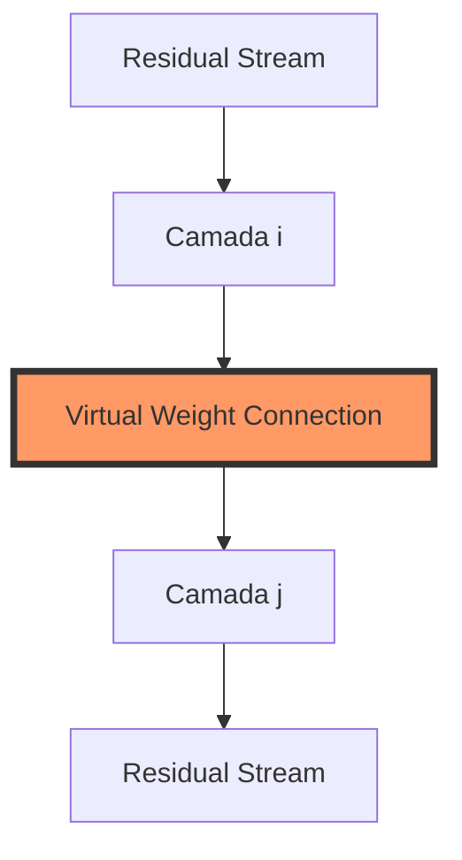
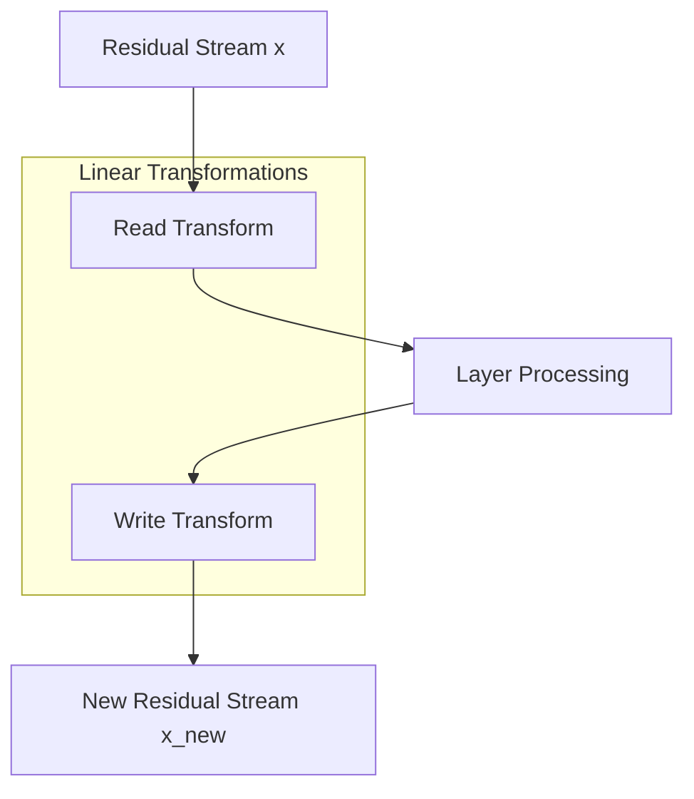
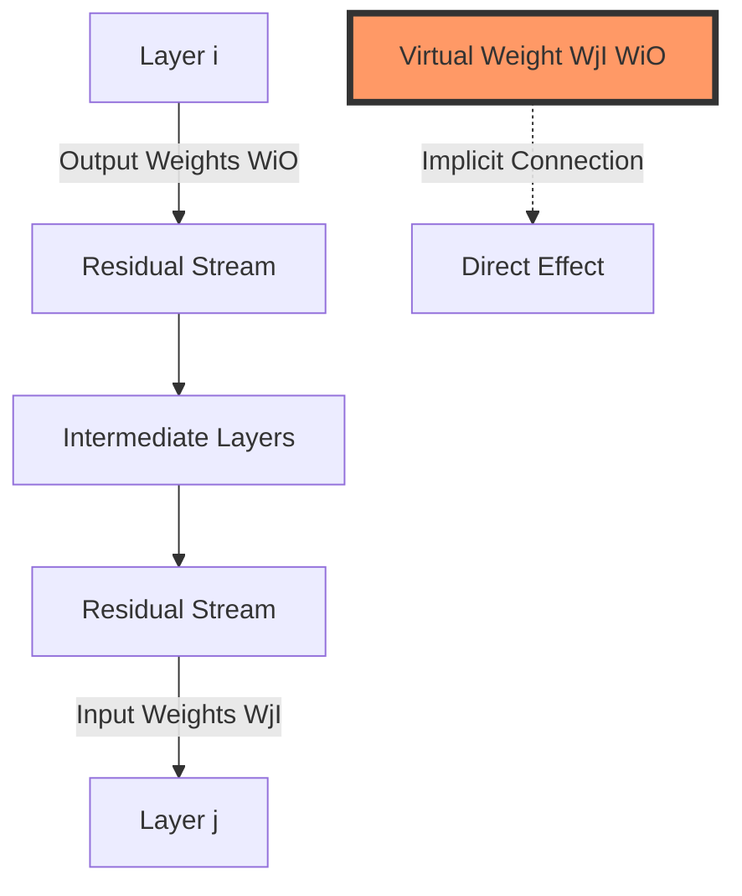
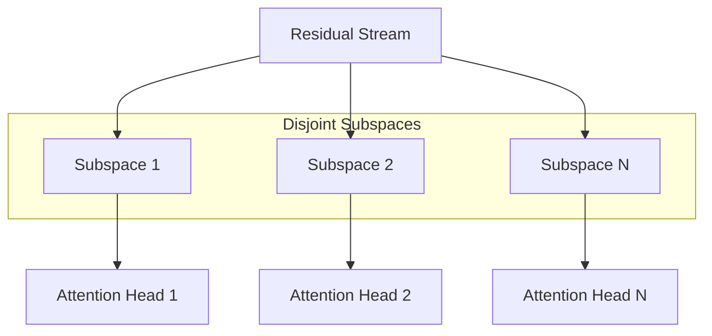
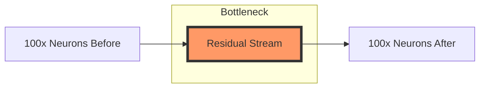
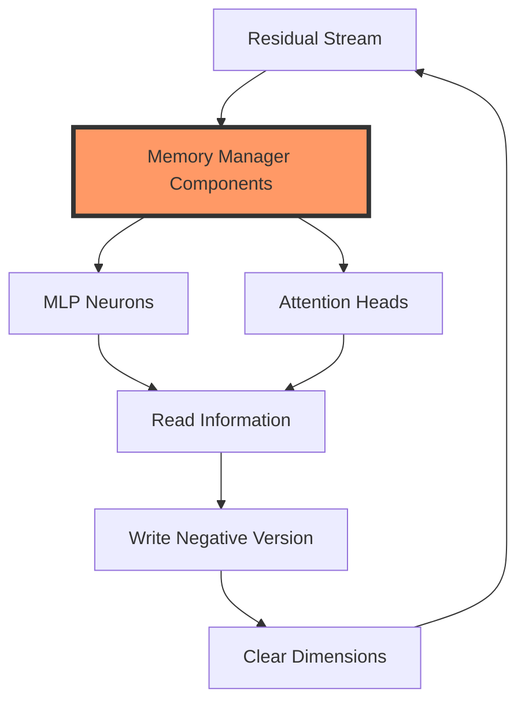

# Virtual Weights e Residual Stream como Canal de Comunicação em LLMs

<imagem: Diagrama complexo mostrando o fluxo de informações através do residual stream em um transformer, destacando as conexões virtuais entre camadas, subspaces de comunicação e as transformações lineares aplicadas em diferentes pontos do modelo>

## Introdução

Os **Modelos de Linguagem de Grande Porte (LLMs)** modernos são construídos sobre uma arquitetura que possui uma característica fundamental: o **residual stream**, um canal de comunicação que permite a transmissão de informações entre diferentes camadas do modelo [^1]. Este mecanismo, aparentemente simples, esconde uma profunda complexidade matemática e teórica que é crucial para entender como os transformers processam e transformam informações.

Uma das características mais notáveis dessa arquitetura é a presença de **virtual weights** - conexões implícitas que emergem da estrutura linear do residual stream [^2]. Estas conexões permitem que camadas distantes do modelo interajam diretamente, criando um rico tecido de comunicação que transcende a hierarquia aparente das camadas.

## Fundamentos do Residual Stream

==O **residual stream** possui uma estrutura profundamente linear que serve como espinha dorsal para a comunicação entre camadas do modelo [^3].== Cada camada realiza duas operações fundamentais:

1. Uma transformação linear para "ler" informações do residual stream
2. Uma transformação linear para "escrever" resultados de volta ao stream

Esta linearidade tem implicações profundas para o funcionamento do modelo:

**Lemma 1 (Invariância de Base do Residual Stream):** *O residual stream não possui uma base privilegiada; uma rotação do espaço vetorial aplicada consistentemente a todas as matrizes que interagem com o stream preserva o comportamento do modelo.*

**Prova:** 
Seja R uma matriz de rotação ortogonal arbitrária. Para qualquer matriz de interação W e vetor do residual stream x:
$$WRR^Tx = Wx$$
Pois $RR^T = I$ para rotações ortogonais. Portanto, a rotação do espaço não afeta o comportamento final do modelo. $\blacksquare$

>  🌀 **Comentário sobre Fundamentos do Residual Stream:** O Lemma 1 sobre a invariância de base é um resultado profundo que conecta-se diretamente com o conceito de **isometrias lineares**. Geometricamente, isto significa que o residual stream opera em um nível mais fundamental que meras coordenadas - ele trabalha com a estrutura intrínseca do espaço vetorial. Visualize um círculo unitário: podemos rotacioná-lo de qualquer ângulo e ele mantém todas suas propriedades geométricas. ==Da mesma forma, o residual stream mantém sua funcionalidade independente de como escolhemos representar seus vetores.==

## Teoria dos Virtual Weights

Os **virtual weights** emergem como uma consequência direta da estrutura linear do residual stream [^4]. Matematicamente, podemos definir os virtual weights entre duas camadas i e j como:

$$W_{virtual} = W^O_j W^I_i$$

onde $W^O_j$ são os pesos de output da camada j e $W^I_i$ são os pesos de input da camada i.

**Corolário 1:** *A existência de virtual weights permite que informações fluam diretamente entre camadas não adjacentes, criando caminhos de informação que não são explícitos na arquitetura do modelo.*

> 📐 **Comentário sobre Virtual Weights:** A teoria dos virtual weights revela uma propriedade fascinante de **composição de transformações lineares**. ==Geometricamente, podemos visualizar os virtual weights como "atalhos" no espaço vetorial - caminhos diretos que permitem que uma transformação composta $W_{virtual} = W^O_j W^I_i$ atue como uma única transformação linear, mesmo quando as camadas estão separadas por várias outras operações==. Este fenômeno é análogo a como podemos compor rotações em um plano para obter uma única rotação resultante.

## Subspaces e Bandwidth do Residual Stream

Uma característica crucial do residual stream é sua capacidade de atuar como um canal de comunicação de alta dimensionalidade [^5]. O residual stream pode ser decomposto em diferentes subespaços que servem a diferentes propósitos:

$$\text{dim}(R) = \sum_{i=1}^n \text{dim}(S_i)$$

onde R é o espaço total do residual stream e $S_i$ são os subespaços funcionais.

**Lemma 2 (Capacidade de Comunicação):** *A capacidade efetiva de comunicação do residual stream é limitada pelo número de dimensões independentes que podem ser utilizadas simultaneamente.*

**Prova:**
Seja n o número de camadas comunicando simultaneamente e d a dimensionalidade do residual stream. Para comunicação independente:
$$\sum_{i=1}^n \text{rank}(W_i) \leq d$$
onde $W_i$ são as matrizes de projeção das camadas. $\blacksquare$

> 🌀 **Comentário sobre Subspaces e Bandwidth:** A decomposição do residual stream em subespaços funcionais representa uma aplicação elegante da **teoria de decomposição de espaços vetoriais**. Geometricamente, cada subespaço pode ser visualizado como um "canal" independente no espaço total, onde diferentes tipos de informação podem fluir sem interferência. O Lemma 2 sobre capacidade de comunicação é essencialmente um resultado sobre a **dimensão do span** de múltiplos subespaços operando simultaneamente.

[^1]: "Uma das principais características da arquitetura de alto nível de um transformer é que cada camada adiciona seus resultados ao que chamamos de 'residual stream'" *(Mathematical Framework for Transformer Circuits)*

[^2]: "Uma consequência especialmente útil do residual stream ser linear é que podemos pensar em 'virtual weights' implícitos conectando diretamente qualquer par de camadas" *(Mathematical Framework for Transformer Circuits)*

[^3]: "O residual stream tem uma estrutura profundamente linear. Cada camada realiza uma transformação linear arbitrária para 'ler' informações do residual stream no início, e realiza outra transformação linear antes de adicionar para 'escrever' sua saída de volta ao residual stream" *(Mathematical Framework for Transformer Circuits)*

[^4]: "Virtual weights são o produto dos pesos de saída de uma camada com os pesos de entrada de outra, e descrevem a extensão em que uma camada posterior lê as informações escritas por uma camada anterior" *(Mathematical Framework for Transformer Circuits)*

[^5]: "O residual stream é um espaço vetorial de alta dimensão. Em modelos pequenos, pode ter centenas de dimensões; em modelos grandes pode chegar a dezenas de milhares" *(Mathematical Framework for Transformer Circuits)*

## Estrutura Linear e Transformações no Residual Stream

O aspecto mais fundamental do residual stream é sua **estrutura profundamente linear** [^6]. Esta característica define como a informação flui e é transformada através do modelo. Vamos explorar as implicações matemáticas desta estrutura.

### Transformações Lineares no Residual Stream

Para cada camada do modelo, duas transformações lineares cruciais são aplicadas:

1. **Transformação de Leitura (Read)**: 
$$y_{read} = W_{read}x$$
onde $x$ é o vetor no residual stream e $W_{read}$ é a matriz de transformação linear de leitura.

2. **Transformação de Escrita (Write)**:
$$x_{new} = x + W_{write}y_{processed}$$
onde $y_{processed}$ é o resultado do processamento interno da camada.

**Lemma 3 (Composição de Transformações):** *A sequência de transformações lineares no residual stream pode ser expressa como uma única transformação linear composta.*

**Prova:**
Considere duas camadas consecutivas com transformações $T_1$ e $T_2$:
$$T_{combined}(x) = T_2(T_1(x) + x) + (T_1(x) + x)$$
$$= T_2T_1(x) + T_2(x) + T_1(x) + x$$
$$= (T_2T_1 + T_2 + T_1 + I)x$$

Sendo uma combinação linear de transformações lineares, $T_{combined}$ é também uma transformação linear. $\blacksquare$

>  📐 **Comentário sobre Estrutura Linear:** A análise das transformações no residual stream exemplifica perfeitamente o poder da **álgebra linear computacional**. ==Geometricamente, cada transformação pode ser visualizada como uma sequência de "dobras" e "esticamentos" do espaço vetorial, onde o Lemma 3 mostra como essas operações podem ser compostas em uma única transformação==. A estrutura profundamente linear permite uma análise elegante através de **autovalores e autovetores**, revelando os "eixos naturais" ao longo dos quais a informação flui.

### Propriedades de Comunicação Linear

A estrutura linear do residual stream tem implicações profundas para a comunicação entre camadas [^7]:

1. **Princípio da Superposição**: Diferentes sinais podem ser transmitidos simultaneamente através do mesmo espaço:

$$x_{total} = \sum_{i=1}^n x_i$$

onde cada $x_i$ representa um sinal independente.

2. **Preservação de Dimensionalidade**: O residual stream mantém sua dimensionalidade constante através das camadas:

$$\text{dim}(x_{out}) = \text{dim}(x_{in}) = d_{model}$$

**Teorema 1 (Capacidade de Comunicação Linear):** *A capacidade de comunicação efetiva do residual stream é limitada superiormente pelo posto da matriz de transformação composta.*

**Prova:**
Seja $W_{comp}$ a matriz de transformação composta para uma sequência de camadas:
$$\text{rank}(W_{comp}) \leq \min(\text{rank}(W_1), ..., \text{rank}(W_n))$$
onde $W_1, ..., W_n$ são as matrizes de transformação individuais.

A dimensionalidade máxima do espaço de comunicação é, portanto:
$$\text{dim}(Im(W_{comp})) = \text{rank}(W_{comp})$$ $\blacksquare$

### Seção Teórica Avançada: Análise do Espaço Nulo em Transformações Residuais

**Pergunta Teórica: Como o espaço nulo das transformações lineares afeta a capacidade de comunicação do residual stream?**

A análise do espaço nulo é fundamental para compreender a perda de informação durante as transformações. Considere:

**Lemma 4 (Preservação de Informação):** *Informação no espaço nulo de uma transformação linear é irrecuperável nas camadas subsequentes.*

**Prova:**
Para uma transformação linear $T$:
$$\forall v \in \text{Null}(T): Tv = 0$$
Portanto, qualquer componente do sinal no $\text{Null}(T)$ é mapeado para zero e não pode ser recuperado por transformações subsequentes. $\blacksquare$

**Corolário 2:** *O espaço efetivo de comunicação é a interseção dos complementos dos espaços nulos das transformações sucessivas.*

[^6]: "O residual stream tem uma estrutura profundamente linear. Cada camada realiza uma transformação linear arbitrária para 'ler' informações do residual stream no início, e realiza outra transformação linear antes de adicionar para 'escrever' sua saída de volta ao residual stream" *(Mathematical Framework for Transformer Circuits)*

[^7]: "Uma vez adicionada, a informação persiste em um subespaço a menos que outra camada ativamente a delete. Desta perspectiva, dimensões do residual stream tornam-se algo como 'memória' ou 'bandwidth'" *(Mathematical Framework for Transformer Circuits)*

## Virtual Weights e Interações entre Camadas

### Teoria dos Virtual Weights e Conectividade Implícita

Os **virtual weights** representam uma das consequências mais profundas da linearidade do residual stream [^8]. ==Eles emergem da multiplicação das interações entre camadas através do residual stream, mesmo quando estas camadas estão separadas por múltiplas outras camadas intermediárias.==

**Definição Formal:** Para duas camadas i e j, os virtual weights são definidos como:

$$W_{virtual}^{i→j} = W_j^I W_i^O$$

onde:
- $W_i^O$ são os pesos de saída da camada i
- $W_j^I$ são os pesos de entrada da camada j

### Propriedades Fundamentais dos Virtual Weights

**Lemma 5 (Composição de Virtual Weights):** *Os virtual weights entre camadas não adjacentes podem ser decompostos em produtos de virtual weights intermediários.*

**Prova:**
Para camadas i, j, k onde i < j < k:
$$W_{virtual}^{i→k} = W_k^I W_i^O = W_k^I(W_j^I W_j^O)W_i^O = (W_k^I W_j^O)(W_j^I W_i^O)$$
$$= W_{virtual}^{j→k}W_{virtual}^{i→j}$$ $\blacksquare$

**Teorema 2 (Rank dos Virtual Weights):** *O rank dos virtual weights é limitado pelo menor rank das matrizes componentes.*

$$\text{rank}(W_{virtual}^{i→j}) \leq \min(\text{rank}(W_j^I), \text{rank}(W_i^O))$$

**Prova:**
Pela propriedade do rank de produtos matriciais:
$$\text{rank}(AB) \leq \min(\text{rank}(A), \text{rank}(B))$$
Aplicando diretamente aos virtual weights:
$$\text{rank}(W_j^I W_i^O) \leq \min(\text{rank}(W_j^I), \text{rank}(W_i^O))$$ $\blacksquare$

### Implicações para o Fluxo de Informação

A existência de virtual weights tem profundas implicações para o fluxo de informação em transformers [^9]:

1. **Comunicação Direta:** Camadas podem efetivamente se comunicar mesmo estando distantes na arquitetura.

2. **Subspace Targeting:** Uma camada pode escrever informação em um subespaço específico que será lido por uma camada posterior:

$$y_j = W_{virtual}^{i→j}x_i = W_j^I W_i^O x_i$$

### Seção Teórica Avançada: Análise Espectral dos Virtual Weights

**Pergunta Teórica: Como a decomposição espectral dos virtual weights revela padrões de comunicação no transformer?**

A análise espectral dos virtual weights fornece insights profundos sobre os canais de comunicação efetivos entre camadas.

**Lemma 6 (Decomposição dos Canais de Comunicação):** *Os autovalores dos virtual weights representam a força dos canais de comunicação independentes entre camadas.*

**Prova:**
Considere a decomposição em valores singulares (SVD) dos virtual weights:
$$W_{virtual}^{i→j} = U\Sigma V^T$$

Os valores singulares em $\Sigma$ quantificam a força de cada canal de comunicação independente. Para cada valor singular σₖ:
$$\|W_{virtual}^{i→j}v_k\| = σ_k\|v_k\|$$
onde $v_k$ é o k-ésimo vetor singular direito. $\blacksquare$

**Corolário 3:** *A dimensionalidade efetiva da comunicação entre duas camadas é dada pelo número de valores singulares significativamente diferentes de zero nos virtual weights.*

[^8]: "Uma consequência especialmente útil da linearidade do residual stream é que podemos pensar em 'virtual weights' implícitos conectando diretamente qualquer par de camadas, mesmo aquelas separadas por muitas outras camadas" *(Mathematical Framework for Transformer Circuits)*

[^9]: "Os virtual weights são o produto dos pesos de saída de uma camada com os pesos de entrada de outra, e descrevem a extensão em que uma camada posterior lê as informações escritas por uma camada anterior" *(Mathematical Framework for Transformer Circuits)*

## Subespaços e Dimensionalidade no Residual Stream

### Estrutura Dimensional e Comunicação

O **residual stream** é caracterizado por sua alta dimensionalidade [^10], que varia de:
- Centenas de dimensões em modelos pequenos
- Dezenas de milhares de dimensões em modelos grandes

### Teoria dos Subespaços de Comunicação

**Lemma 7 (Decomposição em Subespaços):** *O residual stream R pode ser decomposto em uma soma direta de subespaços funcionalmente independentes.*

**Prova:**
Seja R o espaço vetorial total do residual stream:
$$R = S_1 \oplus S_2 \oplus ... \oplus S_n$$
onde $S_i$ são subespaços linearmente independentes e $\oplus$ denota a soma direta.

Para quaisquer vetores $v_i \in S_i$:
$$\sum_{i=1}^n v_i = 0 \implies v_i = 0 \;\; \forall i$$ $\blacksquare$

### Attention Heads e Subespaços

A interação entre attention heads e subespaços é particularmente significativa [^11], pois:

1. **Dimensionalidade Reduzida:** Cada attention head opera em subespaços relativamente pequenos:
   - Tipicamente 64 ou 128 dimensões
   - $\text{dim}(S_{head}) \ll \text{dim}(R)$

2. **Independência Operacional:** Heads podem operar em subespaços disjuntos:

**Teorema 3 (Independência de Attention Heads):** *Attention heads operando em subespaços disjuntos não interferem entre si.*

**Prova:**
Sejam $H_1$ e $H_2$ duas attention heads operando nos subespaços $S_1$ e $S_2$ respectivamente.
Se $S_1 \cap S_2 = \{0\}$, então:
$$\forall v_1 \in S_1, v_2 \in S_2: H_1(v_1 + v_2) = H_1(v_1)$$
$$H_2(v_1 + v_2) = H_2(v_2)$$ $\blacksquare$

> 🌀 **Comentário sobre Subespaços:** O Teorema 3 sobre independência de attention heads é um resultado profundo sobre **ortogonalidade de subespaços**. Geometricamente, podemos visualizar cada attention head como operando em seu próprio "plano" independente no espaço total, com interferência mínima entre eles quando os subespaços são aproximadamente ortogonais. A análise dos ângulos principais fornece uma medida quantitativa do grau de separação entre estes subespaços operacionais.

### Eficiência na Comunicação através de Subespaços

A estrutura de subespaços permite uma comunicação eficiente entre camadas [^12]:

**Corolário 4:** *A capacidade total de comunicação paralela é limitada pela dimensionalidade do residual stream.*

$$\sum_{i=1}^n \text{dim}(S_i) \leq \text{dim}(R)$$

### Seção Teórica Avançada: Análise da Interferência entre Subespaços

**Pergunta Teórica: Como quantificar e minimizar a interferência entre attention heads quando seus subespaços não são perfeitamente disjuntos?**

A interferência entre subespaços pode ser analisada através da teoria de ângulos principais entre subespaços.

**Lemma 8 (Ângulos Principais e Interferência):** *O grau de interferência entre duas attention heads pode ser quantificado pelos ângulos principais entre seus subespaços operacionais.*

**Prova:**
Para subespaços $S_1$ e $S_2$, o primeiro ângulo principal θ é dado por:
$$\cos(\theta) = \max_{u \in S_1, v \in S_2} \frac{|⟨u,v⟩|}{\|u\|\|v\|}$$

A interferência máxima é proporcional a $\cos(\theta)$. $\blacksquare$

**Corolário 5:** *Para minimizar a interferência, os subespaços operacionais das attention heads devem ser aproximadamente ortogonais.*

[^10]: "O residual stream é um espaço vetorial de alta dimensionalidade. Em modelos pequenos, pode ter centenas de dimensões; em modelos grandes pode chegar a dezenas de milhares" *(Mathematical Framework for Transformer Circuits)*

[^11]: "Isto é especialmente importante no caso de attention heads, já que cada head individual opera em subespaços comparativamente pequenos (frequentemente 64 ou 128 dimensões), e pode facilmente escrever em subespaços completamente disjuntos e não interagir" *(Mathematical Framework for Transformer Circuits)*

[^12]: "Layers podem enviar diferentes informações para diferentes layers armazenando-as em diferentes subespaços" *(Mathematical Framework for Transformer Circuits)*

## Superposição e Gargalo de Comunicação no Residual Stream

### O Fenômeno do Gargalo Dimensional

Em transformers profundos, surge um fenômeno fascinante de gargalo dimensional [^13]. Considere uma camada intermediária (como a camada 25 de um transformer de 50 camadas):

**Teorema 4 (Gargalo de Comunicação):** *O residual stream atua como um gargalo de informação onde múltiplos sinais devem coexistir em superposição.*

**Prova:**
Seja:
- $N_{before}$ = número de neurônios antes do residual stream
- $N_{after}$ = número de neurônios após o residual stream
- $d$ = dimensionalidade do residual stream

Temos:
$$N_{before} \approx N_{after} \approx 100d$$

A informação deve ser comprimida por um fator de aproximadamente:
$$\text{compression\_ratio} = \frac{N_{before} \times N_{after}}{d^2} \approx 10000$$ $\blacksquare$

### Superposição de Informação

A superposição de informação no residual stream pode ser modelada matematicamente:

**Lemma 9 (Superposição Linear):** *Múltiplos sinais podem coexistir no mesmo espaço através de combinações lineares.*

**Prova:**
Para sinais $s_1, ..., s_n$ e coeficientes $α_1, ..., α_n$:
$$x = \sum_{i=1}^n α_is_i$$

A recuperação do sinal original é possível se os vetores base são aproximadamente ortogonais:
$$⟨s_i, s_j⟩ \approx 0 \text{ para } i ≠ j$$ $\blacksquare$

> 📐 **Comentário sobre Superposição:** O fenômeno do gargalo dimensional ilustra belamente o conceito de **compressão linear**. Geometricamente, podemos visualizar isto como um processo onde informação de um espaço de alta dimensão deve ser "comprimida" para passar através de um espaço de menor dimensão, mantendo sua estrutura essencial. O Teorema 4 quantifica precisamente este gargalo em termos de dimensões dos espaços envolvidos.

### Mecanismos de Comunicação em Superposição

Para lidar com este gargalo extremo, o transformer emprega várias estratégias [^14]:

1. **Codificação Distribuída:**
$$x = \sum_{i=1}^n w_iv_i$$
onde $w_i$ são pesos aprendidos e $v_i$ são vetores de base.

2. **Projeções Ortogonais:**
   - Cada camada aprende a projetar e extrair informação relevante
   - A ortogonalidade aproximada minimiza interferência

**Teorema 5 (Capacidade de Comunicação em Superposição):** *A capacidade efetiva de comunicação através do gargalo é limitada pelo número de direções aproximadamente ortogonais que podem ser mantidas.*

**Prova:**
Para um conjunto de vetores unitários $\{v_i\}$:
$$\text{capacity} \leq \frac{d}{\epsilon^2}$$
onde $d$ é a dimensionalidade e $\epsilon$ é o limite superior tolerável para $|⟨v_i, v_j⟩|$ entre vetores diferentes. $\blacksquare$

### Seção Teórica Avançada: Análise da Interferência em Superposição

**Pergunta Teórica: Como a interferência entre sinais superpostos afeta a capacidade de comunicação efetiva do residual stream?**

A análise da interferência em comunicação superposta é crucial para entender os limites fundamentais do residual stream.

**Lemma 10 (Interferência em Superposição):** *A interferência entre sinais superpostos cresce quadraticamente com o número de sinais.*

**Prova:**
Para n sinais com correlações médias $ρ$:
$$\text{Interference}(n) = \binom{n}{2}ρ = \frac{n(n-1)}{2}ρ$$

O erro na recuperação de cada sinal é proporcional a $\sqrt{\text{Interference}(n)}$. $\blacksquare$

**Corolário 6:** *Existe um trade-off fundamental entre o número de sinais que podem ser superpostos e a fidelidade de sua recuperação.*

[^13]: "Por exemplo, na camada 25 de um transformer de 50 camadas, o residual stream tem 100 vezes mais neurônios do que tem dimensões antes dele, tentando se comunicar com 100 vezes mais neurônios do que tem dimensões depois dele, de alguma forma se comunicando em superposição!" *(Mathematical Framework for Transformer Circuits)*

[^14]: "Chamamos tensores como este de 'ativações gargalo' e esperamos que sejam excepcionalmente desafiadores de interpretar" *(Mathematical Framework for Transformer Circuits)*

## Memory Management no Residual Stream

### Mecanismos de Gerenciamento de Memória

Em resposta à alta demanda por bandwidth no residual stream, emerge um sofisticado sistema de "memory management" [^15]. Este sistema envolve dois componentes principais:

### Teoria do Memory Management Neural

**Teorema 6 (Clearing Mechanism):** *Um neurônio ou attention head pode efetivamente limpar uma dimensão do residual stream através de uma operação de cancelamento.*

**Prova:**
Seja $x$ o valor atual em uma dimensão do residual stream:
1. Leitura: $r = Wx$ onde $W$ é a matriz de leitura
2. Escrita: $y = -Vr$ onde $V$ é a matriz de escrita
3. Resultado final: $x_{new} = x + y = x - VWx = (I - VW)x$

Se $VW \approx I$, então $x_{new} \approx 0$ $\blacksquare$

### Padrões de Memory Management

Dois padrões principais de memory management foram identificados [^16]:

1. **MLP Neurons como Memory Managers:**
   - Caracterizados por alta similaridade cossenoidal negativa entre pesos de entrada e saída
   - $\cos(w_{in}, w_{out}) \ll 0$

2. **Attention Heads como Memory Managers:**
   - Caracterizados por autovalores negativos significativos em suas matrizes $W_{OV}$
   - Tendência a atender à posição atual do token

**Lemma 11 (Memory Management Efficiency):** *A eficiência do memory management é maximizada quando os pesos de entrada e saída são antiparalelos.*

**Prova:**
Para um neurônio com pesos $w_{in}$ e $w_{out}$:
$$\text{clearing\_efficiency} = -\frac{⟨w_{in}, w_{out}⟩}{\|w_{in}\|\|w_{out}\|}$$

A eficiência máxima é atingida quando:
$$w_{out} = -\alpha w_{in}$$
para algum $\alpha > 0$. $\blacksquare$

### Dinâmica do Memory Management

O processo de memory management pode ser:

1. **Incondicional:** Sempre limpa determinadas dimensões
2. **Condicional:** Limpa dimensões apenas em contextos específicos

**Teorema 7 (Memory Management Condicional):** *O memory management condicional permite um controle granular sobre quais informações são mantidas ou descartadas.*

**Prova:**
Seja $c(x)$ uma função de contexto e $m(x)$ uma função de gerenciamento:
$$y = x + c(x)m(x)$$

A limpeza ocorre quando $c(x) ≈ 1$ e $m(x) ≈ -x$
Caso contrário, $c(x) ≈ 0$ ou $m(x)$ preserva a informação. $\blacksquare$

> 🌀 **Comentário sobre Memory Management:** Os mecanismos de gerenciamento de memória representam uma aplicação sofisticada de **projeções ortogonais** e **complementos ortogonais**. Geometricamente, o processo de "limpar" uma dimensão pode ser visualizado como uma projeção que anula componentes específicos do vetor no residual stream, mantendo outros intactos. O Teorema 6 formaliza este processo em termos de operadores lineares complementares.

### Seção Teórica Avançada: Otimalidade em Memory Management

**Pergunta Teórica: Como determinar a estratégia ótima de memory management dado um padrão de uso do residual stream?**

A otimização do memory management envolve um trade-off entre preservação de informação útil e liberação de recursos.

**Lemma 12 (Otimalidade de Memory Management):** *A estratégia ótima de memory management minimiza a interferência enquanto maximiza a utilização do espaço disponível.*

**Prova:**
Seja $U(x)$ a utilidade da informação e $I(x)$ a interferência causada:
$$\text{objective} = \max_{\theta} \mathbb{E}_x[U(x)(1-m_{\theta}(x)) - \lambda I(x)]$$
onde $m_{\theta}(x)$ é a função de memory management parametrizada por $\theta$ e $\lambda$ é um hiperparâmetro de trade-off. $\blacksquare$

[^15]: "Talvez devido a esta alta demanda por bandwidth do residual stream, vimos indícios de que alguns neurônios MLP e attention heads podem desempenhar um tipo de papel de 'gerenciamento de memória', limpando dimensões do residual stream definidas por outras camadas ao ler informações e escrever a versão negativa" *(Mathematical Framework for Transformer Circuits)*

[^16]: "Alguns neurônios MLP têm similaridade cossenoidal muito negativa entre seus pesos de entrada e saída, o que pode indicar deleção de informação do residual stream. Similarmente, algumas attention heads têm autovalores grandes e negativos em sua matriz WOWV e principalmente atendem ao token atual, potencialmente servindo como um mecanismo para deletar informação" *(Mathematical Framework for Transformer Circuits)*
